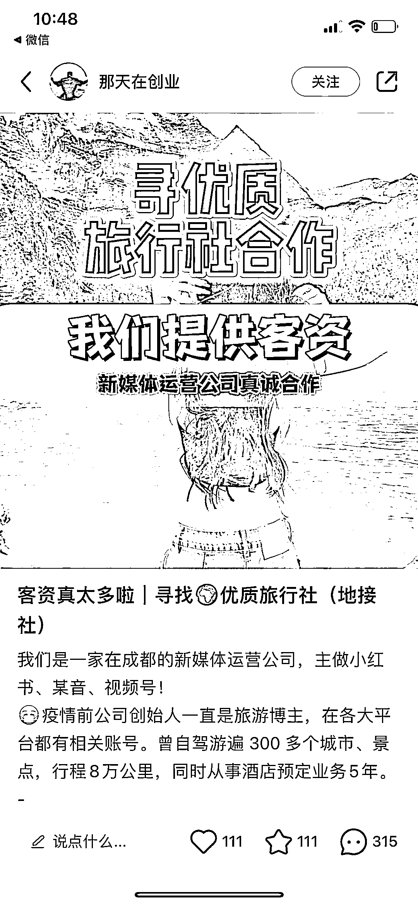
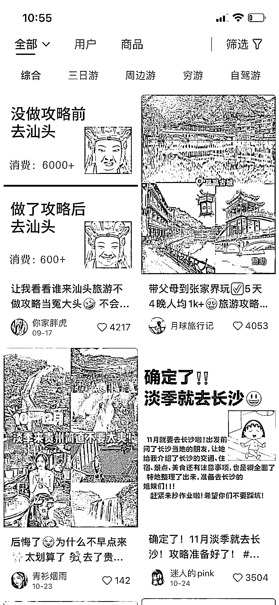

# 普通人参与旅游行业的好方法：卖客资

> 原文：[`www.yuque.com/for_lazy/xkrm14/vgggm7fkyoifvfba`](https://www.yuque.com/for_lazy/xkrm14/vgggm7fkyoifvfba)

作者： 叁斤

日期：2023-11-07

点赞数：**72**

* * *

正文：

普通人参与旅游行业的好方法：卖客资 疫情放开之后，旅游行业迎来了大爆发 普通人没有旅行社资源不好参与
而经过 3 年疫情，自媒体比之前更强大，传统旅行社不懂怎么在自媒体上获客 所以，如果自己知道怎么获客的话，可以直接把客源卖给旅行社 - 1、如何引流
直接套模板发布旅游攻略，引流私域 模板可以到小红书搜旅游攻略，非常多 2、如何找旅行社 可以模仿这个博主，直接在小红书发，评论区有大量咨询，择优入选

* * *

评论区：

田新一 : 我们也在这么做，找到了几十家地接了

BLUE : 结合上条风向标一起看，

叁斤 : 怪不得你能发财[得意][得意]

艾小飞 : 效果咋样[得意]

田新一 : 不错

小孙 : 大佬，链接一下

凡不易 : 如何判断其中的地接靠谱度呢，如果对接给不靠谱的地接会砸自己口碑哈。

* * *

