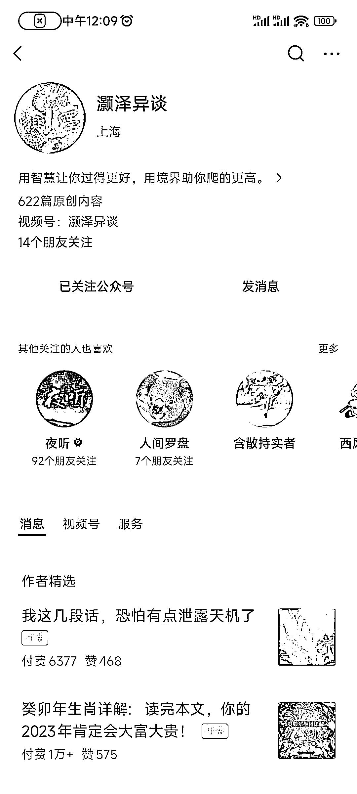
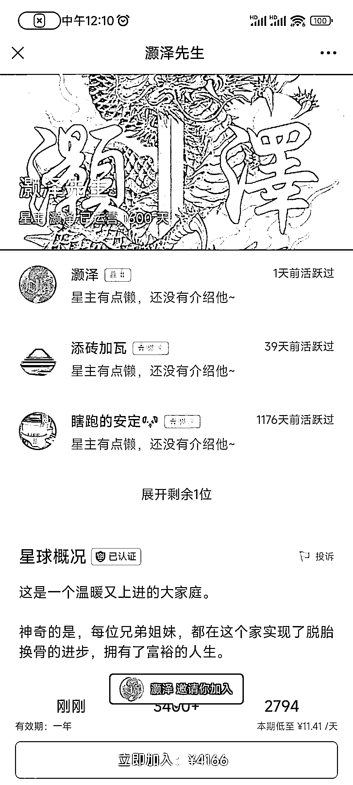

# 玄学领域的大生意，一篇文章就能创收 60w！

> 原文：[`www.yuque.com/for_lazy/xkrm14/zgplzuxbii1iyq4f`](https://www.yuque.com/for_lazy/xkrm14/zgplzuxbii1iyq4f)

作者： 宋东波-进击 2030

日期：2023-11-06

点赞数：**74**

* * *

正文：

玄学里的大生意，一篇文章就能创收 60w！ 而且这个号不止一篇付费文章，很多篇的收入都达到了 10w+的创收。
不仅仅是公众号，他还开了星球，费用也是高得吓人：4166 元/年，目前有 3400+的会员，一年就 1400 多万营收！

* * *

评论区：

朝暮拾花 : 还是这个大佬，我刚刚才看到他的星球，做的很高端

兰心 : 感谢分享[鼓掌]

宋东波-进击 2030 : 是的 差异化的深耕 有内容 够专注

朝暮拾花 : 还得有东西在里面，这个板块的话，骗就很快，要是有真东西，十年起步

宋东波-进击 2030 : 一定不要有骗的妄念 骗一次毁一生

yoyo : 他服务的基本上都是权贵，新贵，客群很高端的

宋东波-进击 2030 : 是的 客户定位很清晰，精准。

* * *

