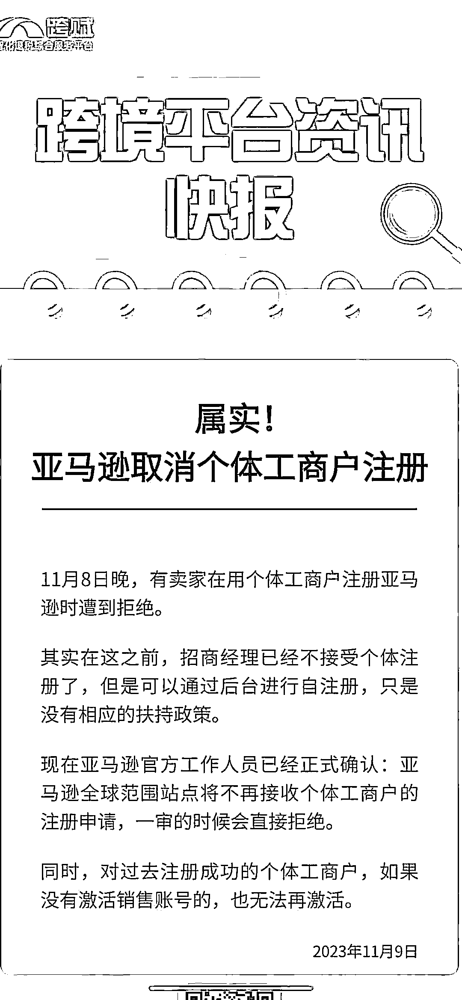

# 小红书、闲鱼等平台或将取消个体工商户？公司性质证照办理或将迎来小幅增长

> 原文：[`www.yuque.com/for_lazy/xkrm14/fnbcqv3l92xiwddo`](https://www.yuque.com/for_lazy/xkrm14/fnbcqv3l92xiwddo)

作者： 玥玥

日期：2023-11-10

点赞数：**54**

* * *

正文：

不知道小红书、闲鱼等平台今后会不会取消个体工商户？ 公司性质证照办理会迎来一批小增量吧

* * *

评论区：

朝颜 : 应该不会，京东以前只能公司注册，今年都对个体户开放了

野猫 : 所言极是，要流量必须容更大的任何形式的群体。有容乃大

* * *

