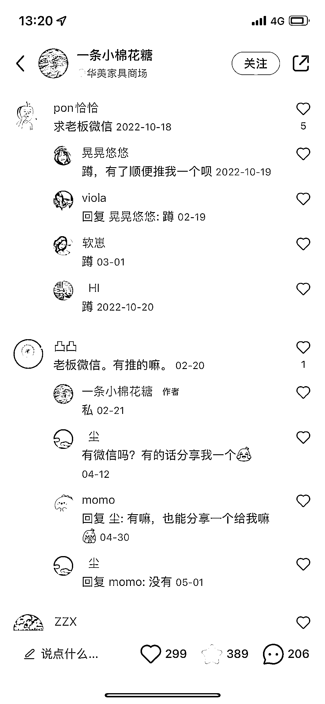
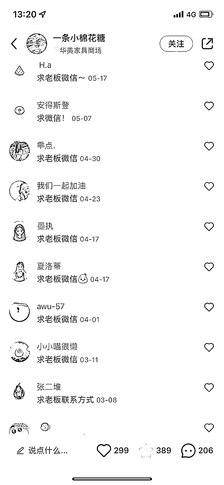

# 同城引流案例，经典第三人称推荐，文案值得学习

> 原文：[`www.yuque.com/for_lazy/xkrm14/ln0fgn92eb7n6fr5`](https://www.yuque.com/for_lazy/xkrm14/ln0fgn92eb7n6fr5)

作者： 商晖

日期：2023-11-10

点赞数：**77**

* * *

正文：

同城引流案例，可引流到实体店，也可以引流到微信。 还是经典的第三人称推荐，文案很值得学习，评论区 200 多条，都是求老板微信的。
这个时候其实应该做的就是，找更多的本地号，把这篇的内容矩阵铺。虽然内容是去年的，但是这种种草性质的玩法长期适用。
真正的第三人称文案就是要写的别人都辨别不出你是托还是真心推荐。

* * *

评论区：

* * *

