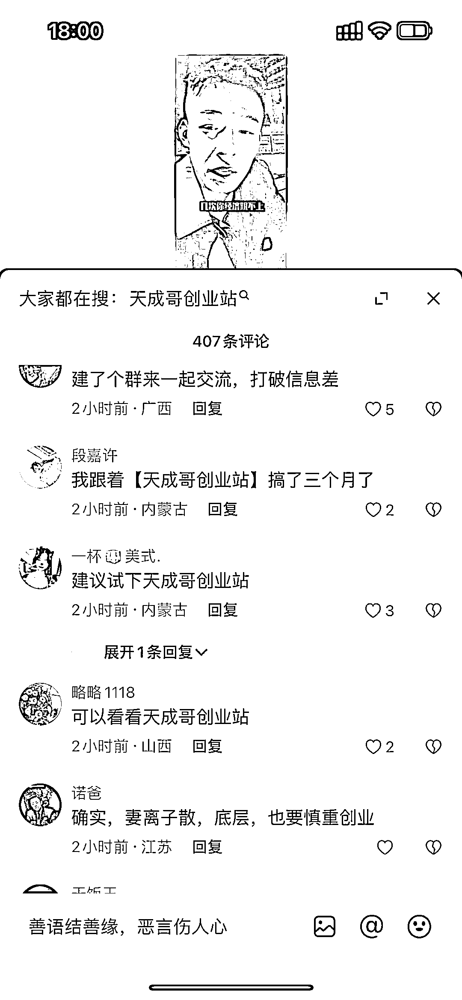
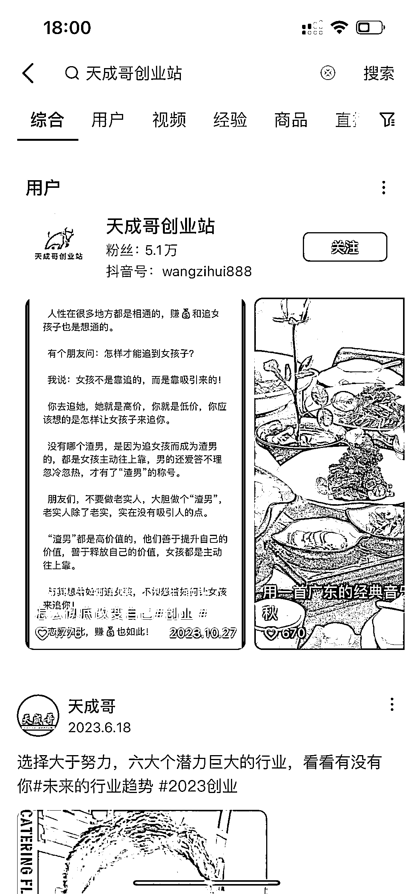

# 新创业引流方式：矩阵或买评论，热门搜索

> 原文：[`www.yuque.com/for_lazy/xkrm14/uhxrsugao7gmhppc`](https://www.yuque.com/for_lazy/xkrm14/uhxrsugao7gmhppc)

作者： 可乐

日期：2023-11-10

点赞数：**96**

* * *

正文：

这两天出现了这种新的创业粉引流，矩阵或者买评论，霸占大家都在搜，再到主页做进一步引流

* * *

评论区：

Allen : 这个是怎么操作的呀？

百万先生 : 博主得气死。

艾小飞 : 这个操作 6

高杰 : 借鸡生蛋啊，我之前也遇到过，结果搜索词变成别人的

+龙 : 之前这样搞，被同行吊了

* * *

公众号懒人找资源，懒人专属群分享