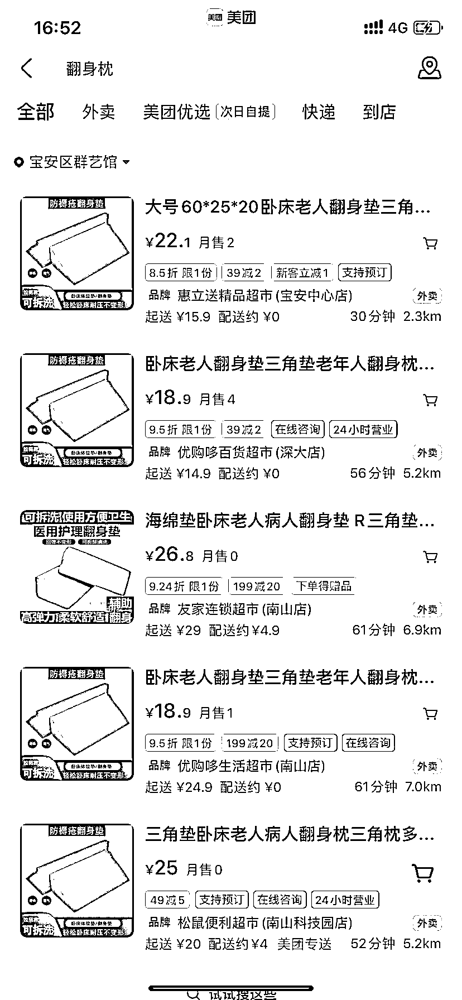

# 美团闪电仓-外卖超市推出住院用品，方便快捷省钱

> 原文：[`www.yuque.com/for_lazy/xkrm14/tcuivozdaoc53mko`](https://www.yuque.com/for_lazy/xkrm14/tcuivozdaoc53mko)

作者： 听听

日期：2023-11-16

点赞数：**108**

* * *

正文：

美团闪电仓/外卖超市的细分——住院用品 之前妈妈住院，买东西都很紧急 一般是术后护士提醒才买相关的护理用品，pdd 翻身垫 10 元，医院海报标价 40 元
跟健康相比，其他都是小事，大家都很愿意加钱购买 美团渠道大家了解比较少，可以做做 现在医院的探视管理也不太严格，可以进去发海报宣传～

* * *

评论区：

* * *

