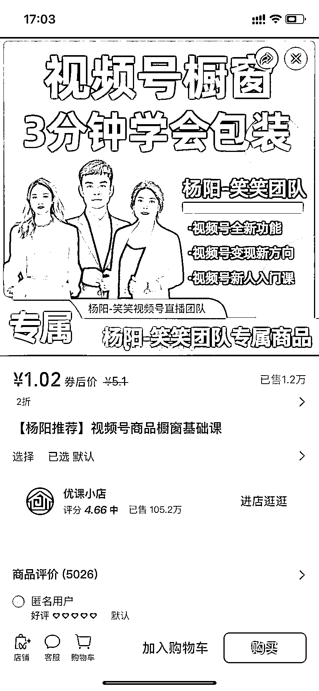
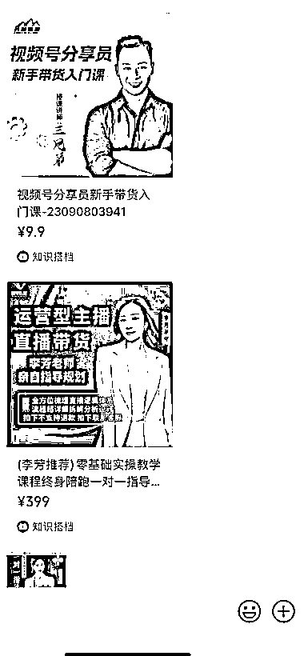
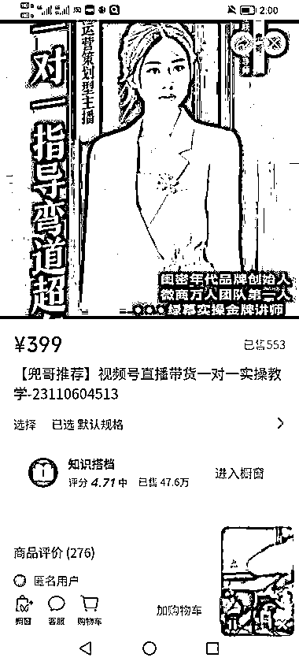

# 视频号分享员火爆，虚拟产品入局有两大优势

> 原文：[`www.yuque.com/for_lazy/xkrm14/akq0yirgsi7z7ofp`](https://www.yuque.com/for_lazy/xkrm14/akq0yirgsi7z7ofp)

作者： 杨飞

日期：2023-11-15

点赞数：**90**

* * *

正文：

视频号分享员，真的很火！ 目前做得挺好的几个团队：三兄弟、刘芳、杨阳、兜哥、高导等。
主要用的平台：视频号小店、知识搭档、小鹅通、优课小店。视频号小店上传教育类目虚拟产品，门槛较高，基本都采用第三方平台，但是第三方平台也是要送审课程给视频号平台审核的！
如果是做虚拟产品的朋友，可以抓紧时间入局了，有 2 大优势： 1、超级转发 2、自动锁客
大量招募分享员，去开直播售卖 9.9 课程，通过这样的形式导流私域，后期再做进阶转化，发展成分销团长，裂变团队来做！
只要你的产品符合视频号小店的要求，都是能玩的，目前我们也在测试，刚把课程上架了千聊、知识搭档、小鹅通以及优课小店！
多渠道上架主要是为了防止单条链接挂了，能第一时间更换产品，旗下主播能继续选品直播带货！

* * *

评论区：

南风 : 老哥 怎么联系。我也想玩 视频号 虚拟类目

非驰 : 老哥怎么联系

大白 : 这帮人都是割韭菜的

梁艳 : 这种课程怎么联系？

杨飞 : 网上买，几块钱一堆资料

杨飞 : 是的，昨天好几个第三方平台都被视频号处罚了，导致正常卖课的，都无法上架过审！

大白 : 我用的那个三方平台就被处罚了，不知道是三天还是七天。

* * *

