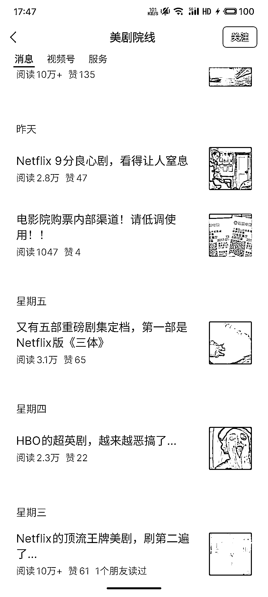

# 公众号流量主的变现方式及潜在收益

> 原文：[`www.yuque.com/for_lazy/xkrm14/roed3sec3fosh1cf`](https://www.yuque.com/for_lazy/xkrm14/roed3sec3fosh1cf)

作者： 石头

日期：2023-11-13

点赞数：**67**

* * *

正文：

公众号流量主 影剧评测推荐类的感觉普遍流量都很高，10w+很普遍， 本身热剧都自带巨大的流量， 然后内容也比较好生产: 个人做号的话:随便剧透一些内容
，加上自己的一些观点 矩阵的话: 结构化的内容，现在 Ai 基本上也可以获取到最新的网络信息 完全可以批量生产内容 变现:除了基础的流量主收益 广告商单
后续还可以私域社群 影视剧虚拟资源 平台 vip app 推广等相关的都可以

* * *

评论区：

* * *

公众号懒人找资源，懒人专属群分享