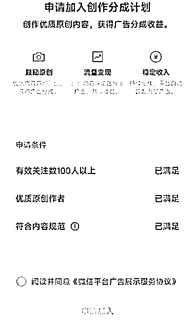

# 视频号分成计划要求解析：符合内容规范的标准是什么？

> 原文：[`www.yuque.com/for_lazy/xkrm14/ap9t3zileox1qfbh`](https://www.yuque.com/for_lazy/xkrm14/ap9t3zileox1qfbh)

作者： 子白

日期：2023-11-14

点赞数：**58**

* * *

正文：

【视频号分成计划】很多小白自己试了很久都没开通计划，满头问号：符合内容规范是啥？怎么才算符合内容规范？ 其实分成计划的要求原来是三条，后来合并了。
新版的“内容规范”包含了“优质原创作者”和“符合内容规范”。 100 粉丝很简单，小爆一个视频就够了，不建议互粉，官方不是傻子。
另外两条分别是符合原创内容和符合平台价值观。
很多人开分成计划都卡在这了，简单做拼接、搬运、音乐、风景、祝福语录这些领域，经常被判内容低质，要求发布 10 条原创自证。
这都是内容原创度低引起的。视频号现在对原创要求特别高，如果被平台判定低质内容，账号的所有视频全都不给流量。
判断方法：打开视频点“加热”，显示不能加热就是低质了。他这不是处罚单条内容，是整个账号的内容全都不能加热，账号内一条原创度不够的视频会连累整个账号。
必须把文案做好，被判低质的概率就低了很多。

* * *

评论区：

前行 : 请问下怎么过内容规范呢？谢谢

* * *

公众号懒人找资源，懒人专属群分享