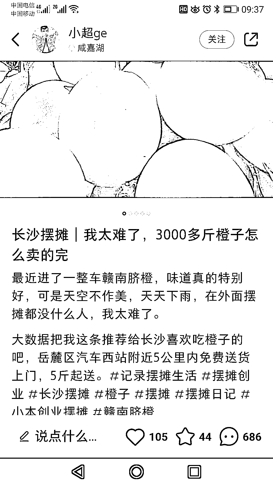
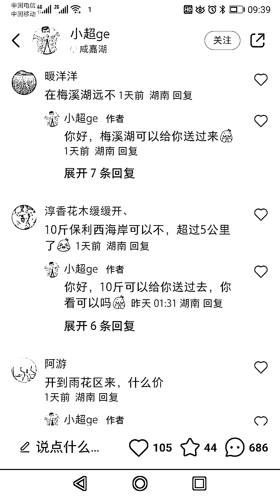

# 摆摊卖水果，通过定位发小红书和抖音引流，积累线上客户

> 原文：[`www.yuque.com/for_lazy/xkrm14/owi4ydvnry9cfn1f`](https://www.yuque.com/for_lazy/xkrm14/owi4ydvnry9cfn1f)

作者： 有有

日期：2023-11-17

点赞数：**74**

* * *

正文：

摆摊时卖水果可以根据定位发小红书，说几公里内愿意开车过去，下图回复也蛮多的，热心的网友还帮忙推荐可以摆摊的地方，引申下抖音、视频号都可以发，加客户微信，时间长了也积累了一批线上客户，还能帮忙推荐，前提是水果性价比高。

* * *

评论区：

公子不咋帅 : 同理，所有的地摊好像也可以

* * *

