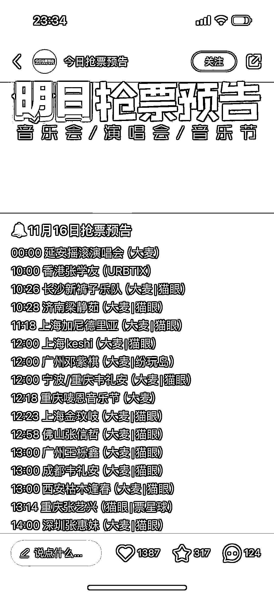

# 小红书成为票贩子的新选择，数据显示用户需求旺盛

> 原文：[`www.yuque.com/for_lazy/xkrm14/qgkr6ps00icala4p`](https://www.yuque.com/for_lazy/xkrm14/qgkr6ps00icala4p)

作者： better me

日期：2023-11-15

点赞数：**58**

* * *

正文：

小红书起号另一种方式，同时适合票贩子。 今日抢票预告 数据很好 8 篇笔记 1.5 万笔记 l 用户需求很大 哪天在哪里抢票哪个明星

* * *

评论区：

肥仔梁 : 怎么变现呢？适合黄牛

better me : 我想的就是直接卖票呀 或者引流私域卖明星周边啥的 还可以和旅行社合作 有些境外演唱会。包括办签证啥的

肥仔梁 : 我去看了一下帐号，流量的确很大

朱长新 : 可以留下钩子，说有人抢到票了，需要转让，让他加微信，然后说她来晚了，然后卖自己的黄牛票

better me : 哈哈哈哈 你这是截流

* * *

