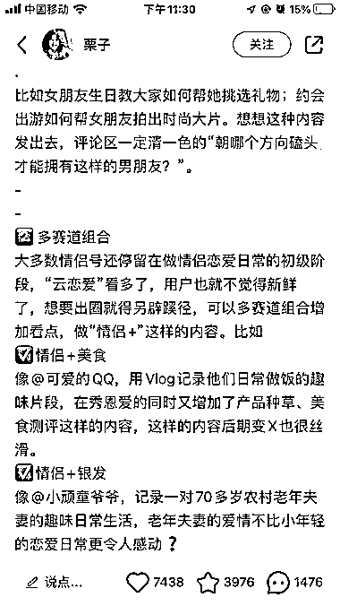
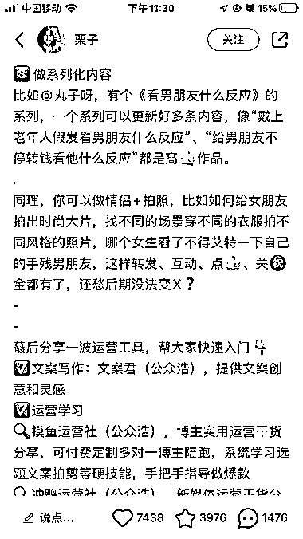

# 小红书上的新思路：自媒体做情侣号引发热议

> 原文：[`www.yuque.com/for_lazy/xkrm14/dpcydk1agyte4hu1`](https://www.yuque.com/for_lazy/xkrm14/dpcydk1agyte4hu1)

作者： 星辰

日期：2023-11-14

点赞数：**59**

* * *

正文：

偶然在小红书上看到的，自媒体做情侣号，这似乎是个新思路，以前从来没想过还有这样的。 好像讨论的很火爆

* * *

评论区：

亚瑟王 : 这类账号粉丝都是想学小红书的人，这种教学博主账号发这类笔记，做情侣号，做旅游号，做小吃号，都会有量，下面评论就是一堆求带，怎么做，dd，或者就是同行 diss，主打一个反正没有绝对答案，全靠自圆其说

* * *

公众号懒人找资源，懒人专属群分享