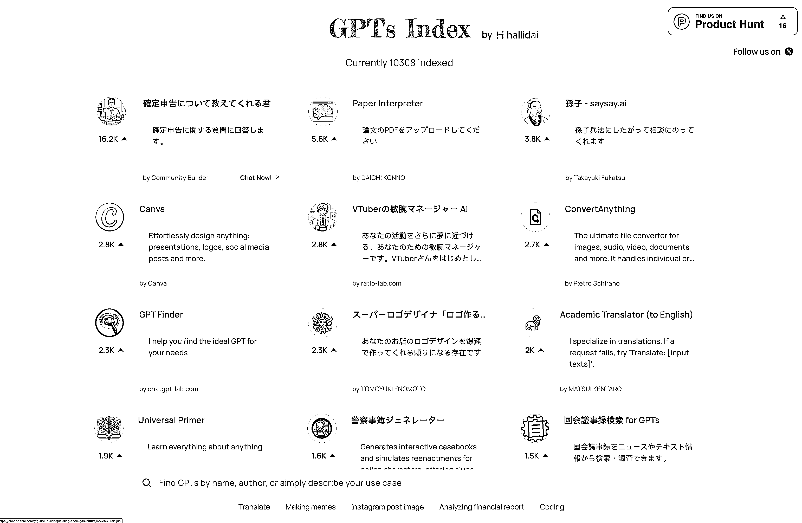

# 利用社交平台数据找到最热门的 GPTs 和其他事物

> 原文：[`www.yuque.com/for_lazy/xkrm14/us578gx2hcwns7ph`](https://www.yuque.com/for_lazy/xkrm14/us578gx2hcwns7ph)

作者： 哥飞

日期：2023-11-15

点赞数：**75**

* * *

正文：

目前在排序算法上看到最有想法的 GPTs 导航站 。 分析每一个 GPTs 在推上被提及的推文热度，最后换算为这个 GPTs 的热度，让你能够看到最热门的
GPTs 是哪一个。 这给我们启发，社交平台的热度是真实的数据，我们如果能够抓取下来，就能够对任何事物进行打分。 书籍推荐分享网站
也是用推特数据做冷启动的。 社交平台数据是个宝，大家可以挖一挖。[GPTs Index - Find the GPT that fits your
needs | b...](https://gpts.hallid.ai/?gefei) [Ideas from Top Books in 3m or
less - BookStash](https://bookstash.io/)

* * *

评论区：

が💉 : 有点看不懂[撇嘴]

* * *

公众号懒人找资源，懒人专属群分享