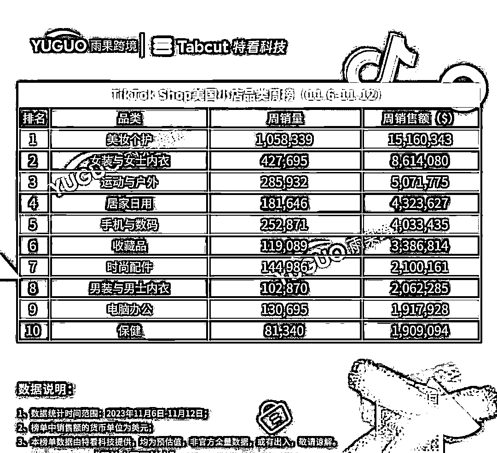

# TIKTOK 美区单周千万人民币 GMV 卖家，美妆个护品类销量领先

> 原文：[`www.yuque.com/for_lazy/xkrm14/ezmdczh2i433u58e`](https://www.yuque.com/for_lazy/xkrm14/ezmdczh2i433u58e)

作者： Max

日期：2023-11-14

点赞数：**48**

* * *

正文：

TIKTOK 美区已出现单周千万人民币 GMV 卖家 根据 tiktok saas 工具 tabcut 抓取到 11.6-11.12 日数据，榜一“美妆个护”品类的周销量
1,058,339 件，周销售额约 1510 万美元；榜二“女装及内衣”品类的周销量 427,659 件，周销售额约 860
万美元；榜三“运动与户外”品类的周销量 285,932 件，周销售额约 507 万美元。 位列榜单第一位是主营“美妆个护”类目小店 Tarte
Cosmetics，其店铺周销售额约 229 万美元，店内爆款“Maracuja 多汁润唇膏”在这一周内共计卖出 61267 件。
女性向的产品趋势一片大好，除此之外，其余类目还有非常大的增长空间。

* * *

评论区：

平凡 : 哎，我 10w 粉丝的号，小黄车被封了[流泪]

* * *

