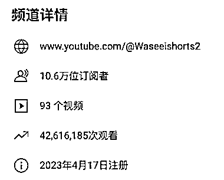
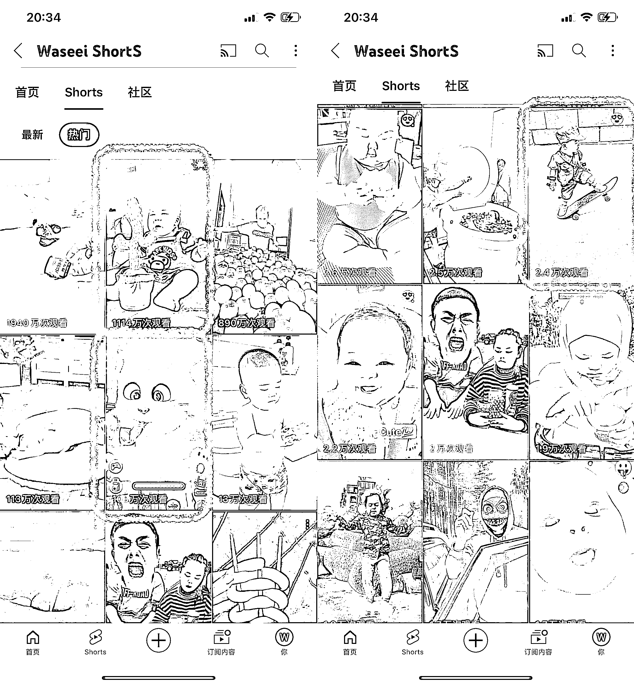

# YouTube Shorts 账号涨粉 10w+，视频播放量突破 4261 万

> 原文：[`www.yuque.com/for_lazy/xkrm14/fpqaf2tozk88lh0s`](https://www.yuque.com/for_lazy/xkrm14/fpqaf2tozk88lh0s)

作者： 林林 AIGC 写作

日期：2023-11-15

点赞数：**39**

* * *

正文：

Youtube shorts 七个月涨粉 10w+，93 个视频总播放量 4261 万
账号主要内容就两类，萌娃与萌宠，这两方面的内容，对全球各地不同语言、国籍、宗教、肤色的用户来说都有很强的普适性，即使最近也有不少视频突破 5 位数。
不过让我觉得最有意思的事这个账号有个萌娃被仙人掌玩具吓哭的视频播放量有 1000 万之多，可见这个账号的变现价值不一定要做私域，销售转化一些有趣的儿童玩具、宠物用品都会是不错的选择。

* * *

评论区：

* * *

公众号懒人找资源，懒人专属群分享