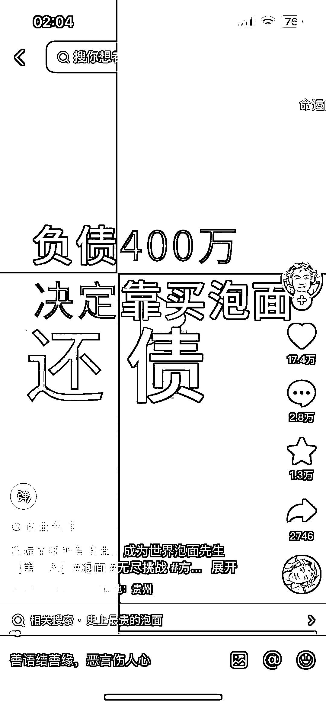
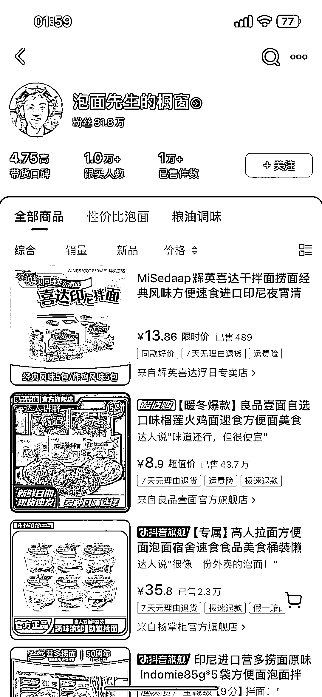

# 负债 400 万，卖泡面还债，成为世界泡面先生

> 原文：[`www.yuque.com/for_lazy/xkrm14/avt1zr3ue2h9hxvg`](https://www.yuque.com/for_lazy/xkrm14/avt1zr3ue2h9hxvg)

作者： 阿龙

日期：2023-11-17

点赞数：**86**

* * *

正文：

刷到这个专卖泡面的号 切入单品类细分赛道做垂做精也可以出圈
“负债 400 万决定靠泡面还债，并吃遍全球泡面，成为世界泡面先生”卖泡面也可以谈到贩卖理想，标签也打得很吸引人，目前做了 2 个多月 68 条作品。

* * *

评论区：

芷蓝 : 哈哈，我也是超爱吃泡面，一直想做个这样的号就是没执行起来哈哈

阿龙 : 哈哈大晚上刷到给我看饿了

星路 : 超喜欢吃辣的泡面，有想过搞，收藏~

阿龙 : 看他的视频真的会忍不住想买😂

星路 : 好奇，我去看看！

星路 : 我看了一下，的确是，梗多也挺可以把握节奏，重点是他说会说补丁视频，把其他口味都尝一次。就感觉到真诚和愉快

阿杜 : 感觉其他食品领域可以起相同的号

* * *

