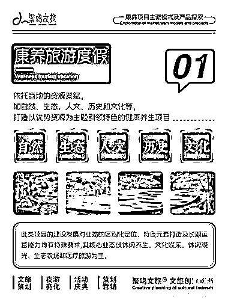

# 康养：老龄化下的新旅游形式

> 原文：[`www.yuque.com/for_lazy/xkrm14/zp5qk4tz50lgclrr`](https://www.yuque.com/for_lazy/xkrm14/zp5qk4tz50lgclrr)

作者： 星辰

日期：2023-11-17

点赞数：**80**

* * *

正文：

近年来出现了一个新词汇，康养 我以前给养老院做过标书，偶然间宣传手册里看到这个词语。现在一些环境好的地区会去申请自己为康养基地。
此外，老龄化的加剧，旅游形式也出现了一些变化。
我妈妈喜欢打太极拳，每天坚持。他们太极拳社团就有举办去陈式太极拳的发源地去旅游。跟我们传统的旅游拍照不一样，他们过去，就是去打太极养生的，也算是旅游的一个新的细分赛道……

* * *

评论区：

张小悦 : 不是新词，地产早就有，就是地产行业没法把这个东西做落地

阿宝 : 卖年金险喜欢搭配的概念，泰康人寿喜欢搞的

星辰 : 对的，别说做普通地产的，我们这有个养老院，本身就在山上，空气也很清新，也是一个小景区，就这样都无法通过审批，更何况那些城市里面的楼盘了，都是概念。

胖大魔 : 是康养➕太极拳，更垂直了

* * *

公众号懒人找资源，懒人专属群分享