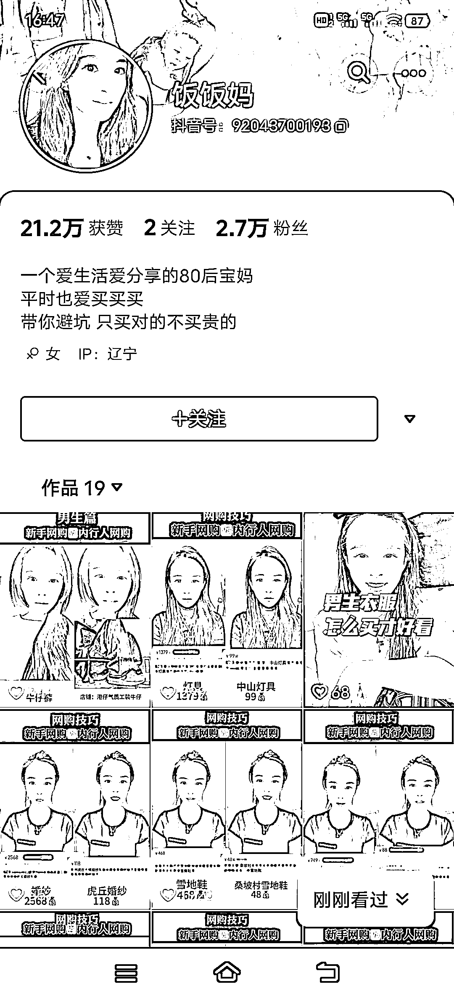
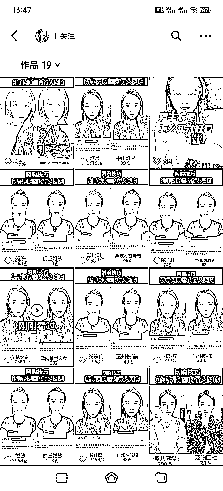

# 对比式账号：垂直购物粉丝带货，快速起号的最佳方法

> 原文：[`www.yuque.com/for_lazy/xkrm14/gwsgew0gyuafu6ix`](https://www.yuque.com/for_lazy/xkrm14/gwsgew0gyuafu6ix)

作者： 领飞懂运营

日期：2023-11-14

点赞数：**95**

* * *

正文：

【对比式账号】19 个作品 2.7 万粉丝，垂直购物粉丝带货，这样的账号，绝对是快速起号的最好方法，最为重要的是也凸显了账号 IP 的专业型。
对比式内容，相当于间接的干货，而且这种干货不废话，所以博取了关注的喜欢。 什么是对比式内容：一边是常规，一边是揭秘
这样的内容值得深挖到各个行业，下面的账号案例，是对准女装，还有童装也可以这样操作，或者把服装类都包含进去，但是人设就要突出：宝妈老剁手党，经验分享，这样就立的住。
这是我在抖音看到的，因此可以复制到小红书，如果口播出镜不行，那就图文形式。
对比式内容，专注到一个领域，一定要找到 100 条以上的内容，这样你再准备去发，不然后期没有库存内容，会很麻烦。
用 100 条就可以打爆账号，准备好随时付费投流，这样把每个内容都利用到极致，上面说到,由于对比式内容观众喜欢这样的形式，所以流量来的非常快。
举一反三，各位尝试运用到自己的领域。
你们可以复制这个账号，直接拿到小红书和视频号，进行操作，再找找更多类似的题材，有些人他的内容不是这样做的，可能某一条是对比式，这时候你就要留心，多搜索，多搜索，就能找到这样的对比性的内容。
[【赚大钱野心】小市民思维学会“存流量”，日拱一卒过河当车（ju）使。](https://articles.zsxq.com/id_rnhrs7k9j7h0.html) 

* * *

评论区：

CC : 视频号我刷到了[憨笑]

* * *

公众号懒人找资源，懒人专属群分享