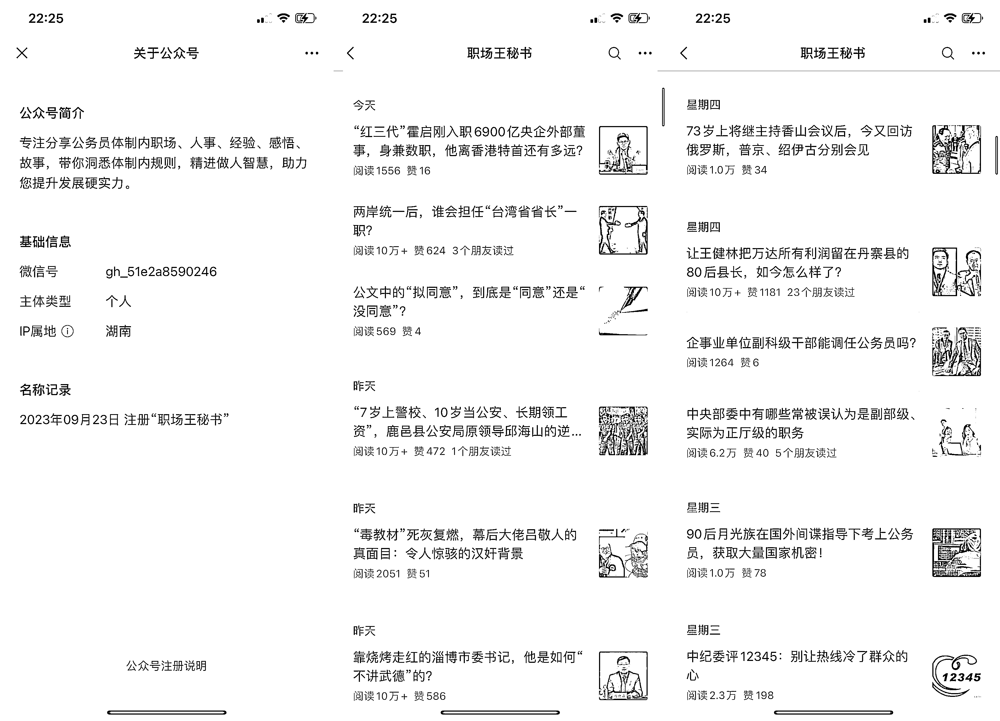

# 《职场王秘书》11 月爆款文章数量翻倍，原因揭秘

> 原文：[`www.yuque.com/for_lazy/xkrm14/zmayeehs208erxlr`](https://www.yuque.com/for_lazy/xkrm14/zmayeehs208erxlr)

作者： 林林 AIGC 写作

日期：2023-11-13

点赞数：**70**

* * *

正文：

9 月底成立的公众号《职场王秘书》，27 篇爆款有 20 篇在 11 月前 11 天发布！
是的，这个公众号虽然是 9 月 23 日才起号，但是 11 月出现的爆款文章的数量，将近 9 月与 10 月爆款文章数量的 3 倍数。
在盘点了这 27 篇爆款文章后（详见文末飞书表格链接），我也发现了为什么《职场王秘书》会在 11 月出现那么多爆款的原因：
首先，从选题来看，该账号在 9 月和 10 月发布的文章，更多的是面向公务员群体的职场干货，甚至是自己编的官场故事，然而读者对此类文章已经审美疲劳，几乎很难有打开甚至读完的想法。而在 11 月以来，这个账号更多的开始发布一些针对国内时政热点的分析与评论，或是从一些更新的角度，去讨论那些看似已经“烂大街”的常青树话题。
其次，从文章的内容来看，不少文章的内容都明显是 GPT 生成的，不过从生成的结果来看，我相信作者肯定在指令方面，会专门要求 GPT 在写作时要注意演好角色、站对立场、保持理性，如此一来，他的账号在 11 月不到半个月的时候，才会蹦出那么多的爆款。
再者，从发布频次来看，作者只要有想法、有灵感、有选题，哪怕已经用完了群发次数，剩下不限次数的发布的功能，作者照样是会尽全力去使用。
总而言之，这个《职场王秘书》从选题到内容，未必是所有想要靠公众号爆文赚钱的玩家们都能“轻松驾驭”的，而这一点也使得他的账号在内容方面充满了高度的不可替代性。不管你想不想对标《职场王秘书》，或者在账号定位上有自己的想法，相信多研究一下这个账号的整体调性，我们也可以得到更多启发。
[`rnadkgsgne.feishu.cn/sheets/VWhZsbfVzhSIcL...`](https://rnadkgsgne.feishu.cn/sheets/VWhZsbfVzhSIcLtJNgmcnRUYnUd) 

* * *

评论区：

穿着裤子的云 : 最近这几天流量下来了

林林 AIGC 写作 : 这时候那些常青树话题就很重要了[呲牙]

霖子 : 请问常青树话题是什么意思呢？

林林 AIGC 写作 : 顾名思义，热点和常青树刚好相反

* * *

公众号懒人找资源，懒人专属群分享