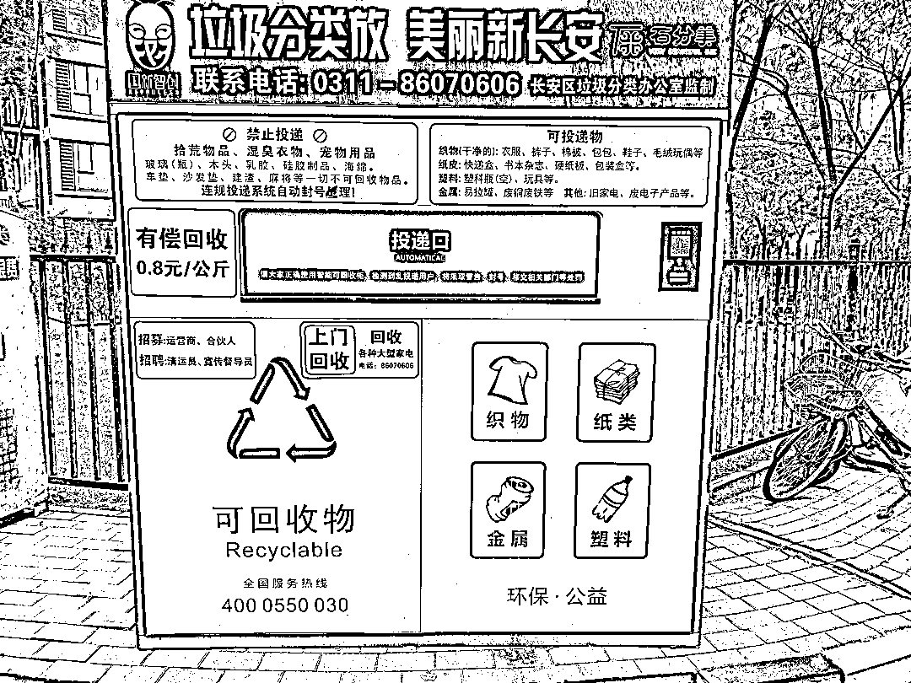

# 小区垃圾有偿回收，市场潜力巨大

> 原文：[`www.yuque.com/for_lazy/xkrm14/ybymbefp1nx5z3ay`](https://www.yuque.com/for_lazy/xkrm14/ybymbefp1nx5z3ay)

作者： 大头

日期：2023-11-16

点赞数：**63**

* * *

正文：

小区的垃圾有偿回收，基本每次去都是满的，回收价格低于废品回收站很多，之前纸箱子都扔垃圾桶，现在都扔这里面，还能换点钱，市场很大

* * *

评论区：

海波  活动策划师 : 很好

Nicole : 怎么放到小区呢？

能量菌 : 这个好

能量菌 : 应该是政府单位牵头搞的

* * *

公众号懒人找资源，懒人专属群分享