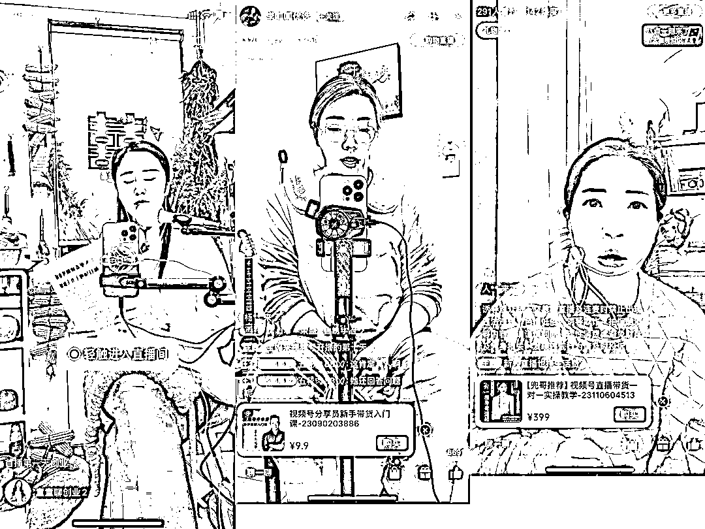

# 直播间虚拟产品销售模式火爆，月入百万的风向标

> 原文：[`www.yuque.com/for_lazy/xkrm14/nctgumxowsut8uqt`](https://www.yuque.com/for_lazy/xkrm14/nctgumxowsut8uqt)

作者： 杨飞

日期：2023-11-13

点赞数：**63**

* * *

正文：

这几天刷视频号，看到很多直播间，都在卖同一套课程，标价 9.9 或者 69.8/399 元，场观都是四五千。
全程看完，发现：1、直播话术一样；2、销售的产品一样；3、全都是虚拟产品；4、最终都导流到了私域； 这套模式，有同行已经跑通了，单月变现了 300 多万出来！
这套玩法接下来一定会有很多做虚拟资料的朋友进入来玩。比如之前在小红书上卖教辅资料的，直接搬到直播间 9.9 卖，再发动家长们做分销裂变。钱赚到手了，流量也屯下来了，一举多得。

* * *

评论区：

PowerBelie : 抖音那种交朋友直播间 完美移植到了视频号

* * *

公众号懒人找资源，懒人专属群分享