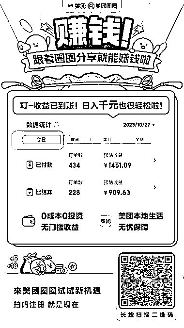
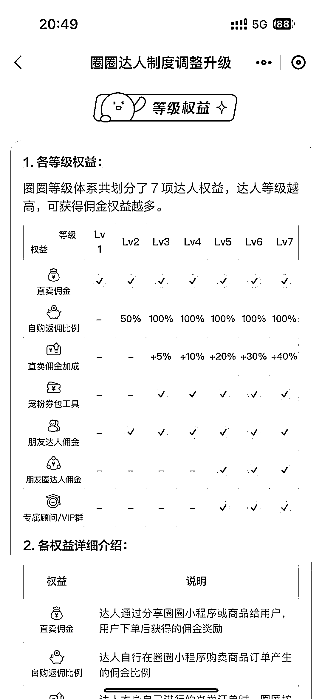
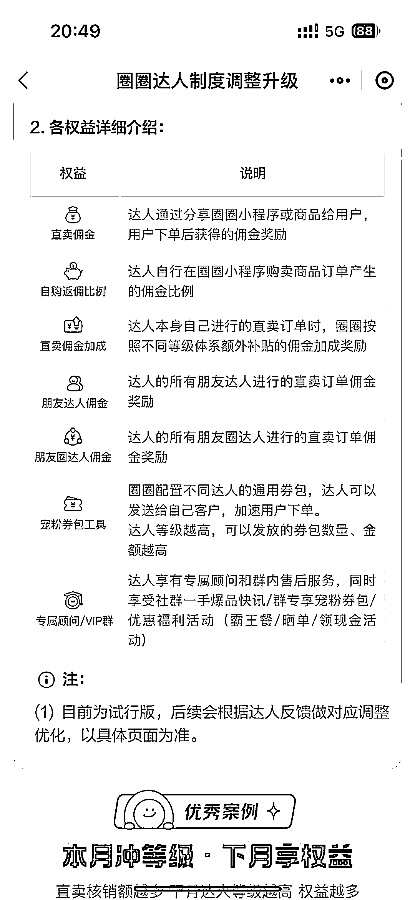
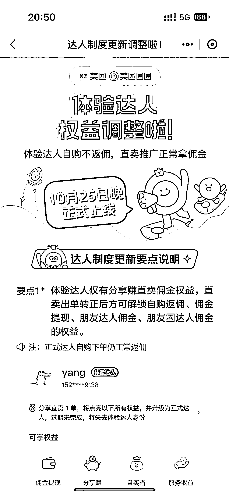

# 美团本地生活服务分销，自用和分销双重优势

> 原文：[`www.yuque.com/for_lazy/xkrm14/mq05ioafzsxtklzn`](https://www.yuque.com/for_lazy/xkrm14/mq05ioafzsxtklzn)

作者： Eric

日期：2023-11-13

点赞数：**50**

* * *

正文：

美团本地生活服务分销来看下 1.可自用：部分套餐有比大众点评价格低 2.可分销：分销佣金可观
需要成为体验达人，推荐商品好友下 1 单后可为正式达人，享受更多权益。 有本地生活私域流量可变现

* * *

评论区：

Eric : 目前刚上线不久，多个城市拉新达人奖励 10 元每人

阿宝 : 貌似是去年上线的

* * *

