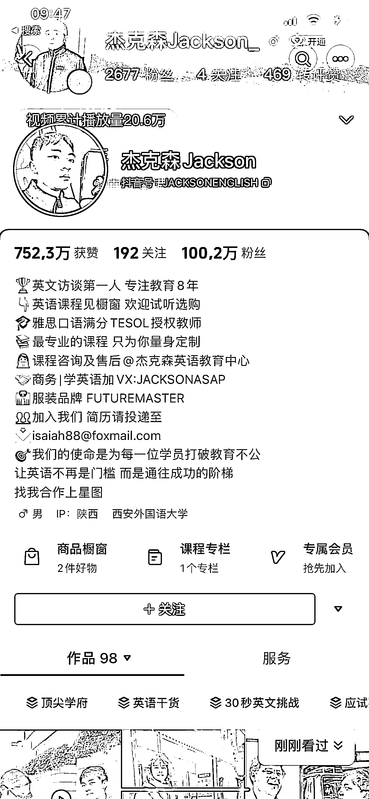

# 商业访谈新思路：大胆创新，不要盲信大 IP

> 原文：[`www.yuque.com/for_lazy/xkrm14/bezl4of8o3xou3rw`](https://www.yuque.com/for_lazy/xkrm14/bezl4of8o3xou3rw)

作者： 林林 AIGC 写作

日期：2023-11-14

点赞数：**50**

* * *

正文：

做商业访谈，一定要大胆创新，不要相信那些大 IP 做的一定都是对的。
今年来各大内容平台涌现出了一批商业访谈类的自媒体 IP，然而大多数存在同质化倾向，从交流的话题，到外景布置几乎一模一样。
就像这位博主，今天的抖音刷到了他在香港街头采访一位高薪律师的视频，两个人站在街角聊了长达十分钟，交流的话题直接绕开了套路化的成长经历，直接抓住了重点（看得出来是有所准备的）。
再者，很有意思的是，他主打的是英文访谈，能够很好地实现降维打击的效果。
当然了，虽然客观上一百多万的粉丝让他的视频得到了不少流量的倾斜，但我们也不可否认，在这背后同样有不少值得我们参考学习的微观方法。

* * *

评论区：

伊晨 : 果然 同行并不是最可怕的对手 跨行业才是

青岛大尧 : 靠卖英语课变现吗

林林 AIGC 写作 : 这个账号的变现途径在他抖音资料里写清楚了，同时你可通过商业访谈的航海手册，了解更多变现途径。

冰蛙 : B 站也刷到了

* * *

