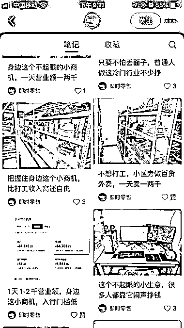
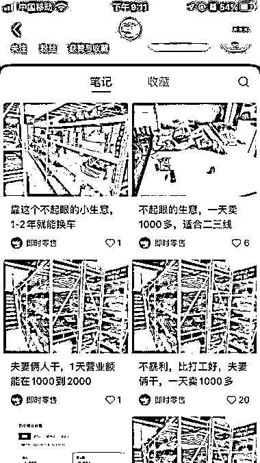
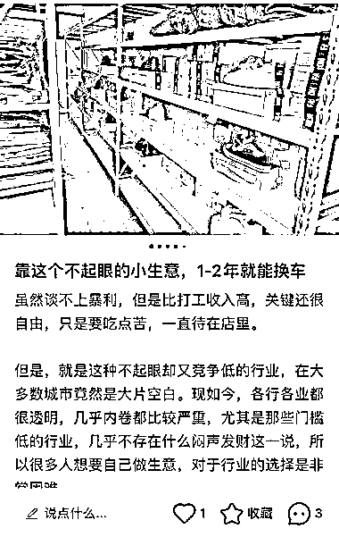
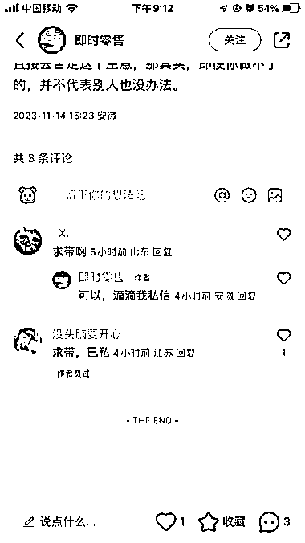

# 朴实无华的小生意，比打工好，引流私域效果贼好

> 原文：[`www.yuque.com/for_lazy/xkrm14/hktv2k9bsvhekw0d`](https://www.yuque.com/for_lazy/xkrm14/hktv2k9bsvhekw0d)

作者： 星辰

日期：2023-11-14

点赞数：**59**

* * *

正文：

小红书看到的，发这种朴实无华的笔记。 标题就写不起眼的小生意，不暴利，比打工好，别嫌生意小等等。配上一个小仓库的图片。 引流私域效果贼好。
不像有的说自己什么副业月入几万，轻松赚钱。那种笔记，人家会觉得你在骗人，而反而是这些朴实无华的笔记，反而好多人求带……

* * *

评论区：

亚瑟王 : 这后端是做什么的？

星辰 : 据说是美团上经营的百货类外卖店

* * *

