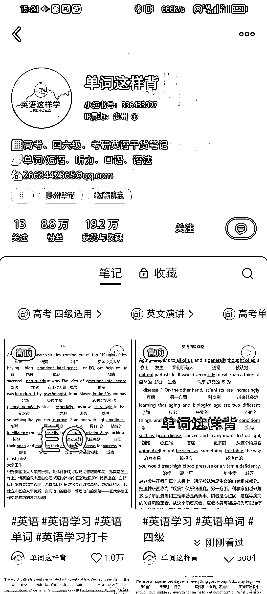
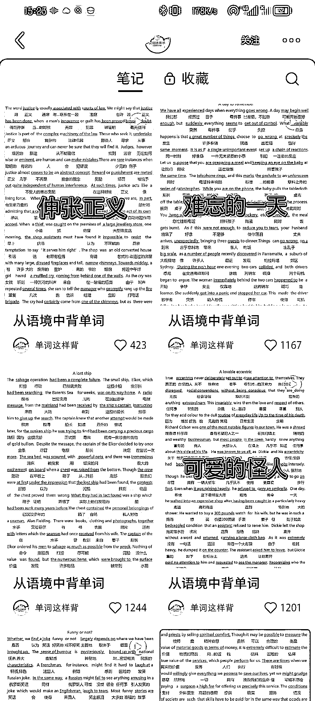

# 小红书英语号：新玩法吸引四六级粉丝，卖考研资料，数据不错

> 原文：[`www.yuque.com/for_lazy/xkrm14/dtxgokk6dia9o7xs`](https://www.yuque.com/for_lazy/xkrm14/dtxgokk6dia9o7xs)

作者： 认知小窗-认哥

日期：2023-11-23

点赞数：**54**

* * *

正文：

小红书英语号新玩法 英语四六级学习号，把单词意思直接写在英文原文下面，后面再加全文，和长句、单词分析。 吸引四六级粉丝，转到私域，卖四六级，考研资料。
数据很不错，也攒了 9 万粉丝了。 上 AI 工具的话，写好提示词，一天 30 分钟，可以出 3-5 篇，非常轻松。 抖音，视频号，微博，公众号可全平台复制，搞矩阵号放大。

* * *

评论区：

认知小窗-认哥 : 谢亦仁大大~

* * *

