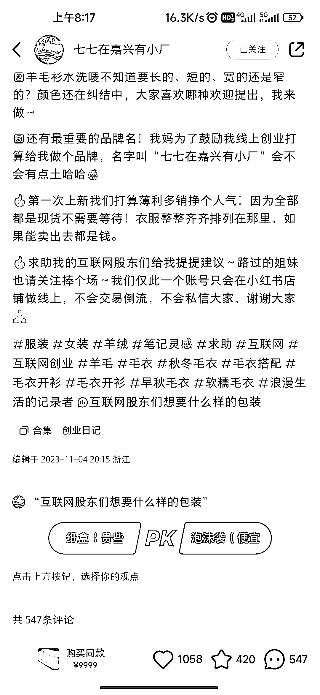
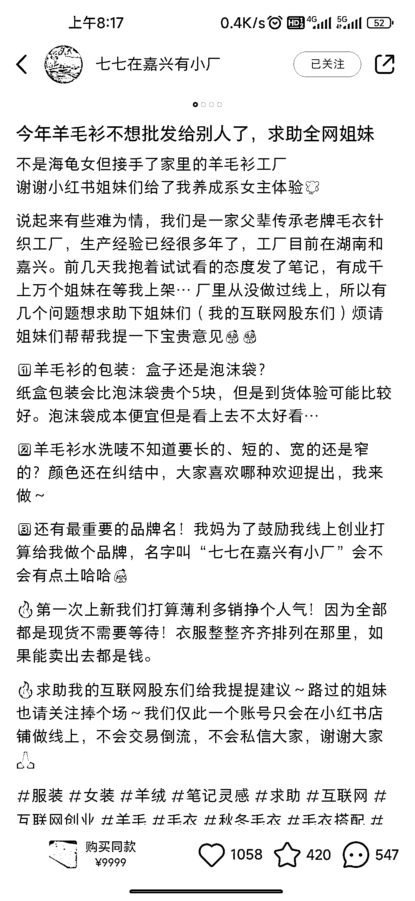
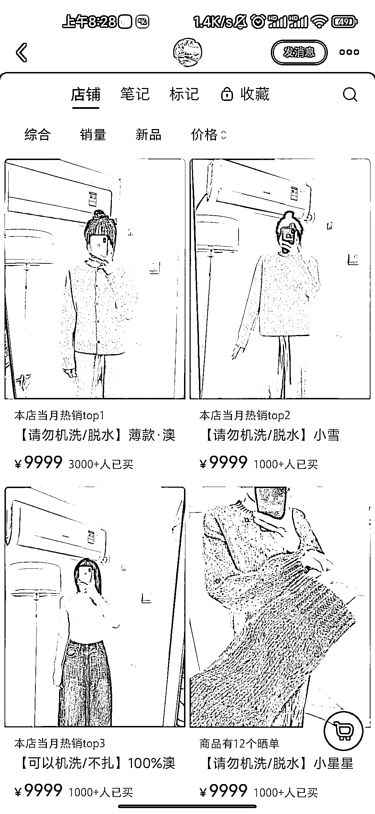

# 小红书电商店铺以真诚营销打造独特 IP

> 原文：[`www.yuque.com/for_lazy/xkrm14/unpqfdqqfqtr7tql`](https://www.yuque.com/for_lazy/xkrm14/unpqfdqqfqtr7tql)

作者： 山止川行

日期：2023-11-23

点赞数：**53**

* * *

正文：

小红书电商
背景信息作为营销中的一环起的作用非常大，这个店铺在 11.04 号发的第一条笔记，图片拍摄工厂代工情况，笔记内容:剧本+引导评论+投票互动，直接拉爆了第一条笔记
后续的每一篇文章都具有工厂实况拍摄或者产品 live 图直出，让用户感觉到了真诚
厂二代接厂创业+网友养成系+live 图直出，好故事+好图，感觉一个电商 ip 已经呈现出来了

* * *

评论区：

能量菌 : 客单这么高嘛

东隅不失 : 9999 应该是防拍链接

默默在学习 : 很多产品都可以按这个思路

* * *

