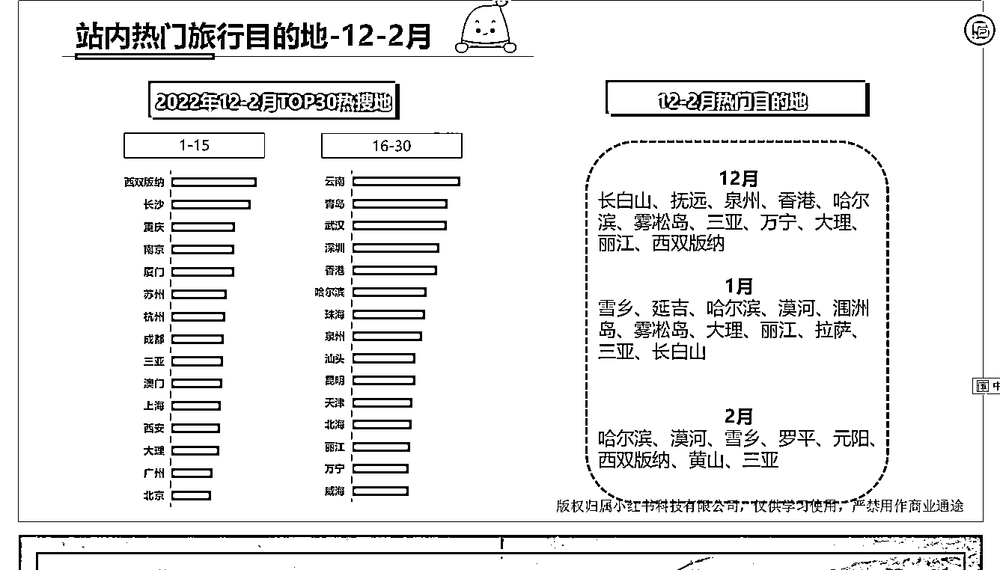
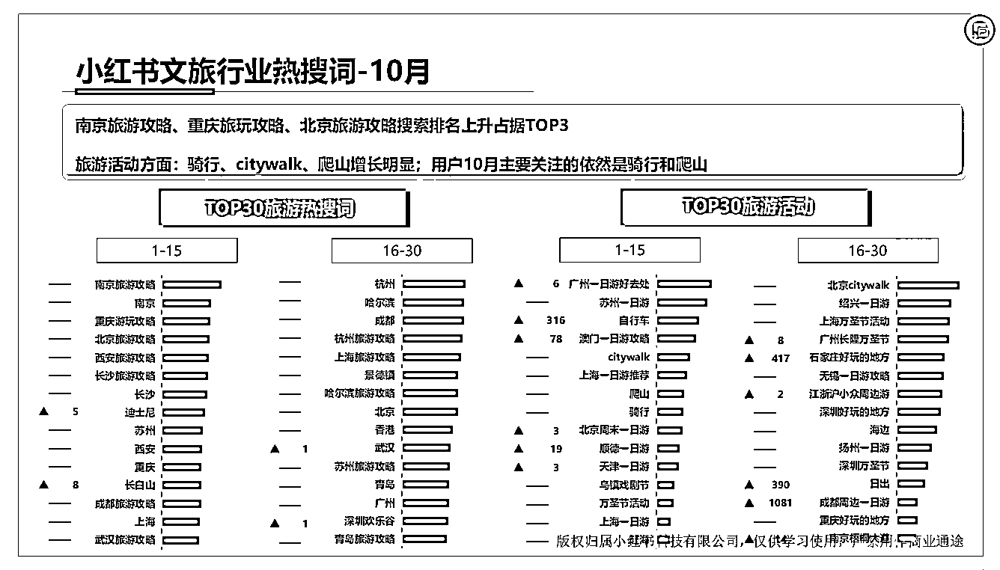

# 小红书旅游航海项目参考文旅月报，探索去年同期热门搜索地和景点

> 原文：[`www.yuque.com/for_lazy/xkrm14/cf8r5lyvgm0polgo`](https://www.yuque.com/for_lazy/xkrm14/cf8r5lyvgm0polgo)

作者： 颜乐乐

日期：2023-11-23

点赞数：**43**

* * *

正文：

最近开启的小红书旅游航海项目，可以参考 10 月的文旅月报中提到的这个 去年同期 12 月-2 月的热门搜索地和景点。

* * *

评论区：

* * *

公众号懒人找资源，懒人专属群分享