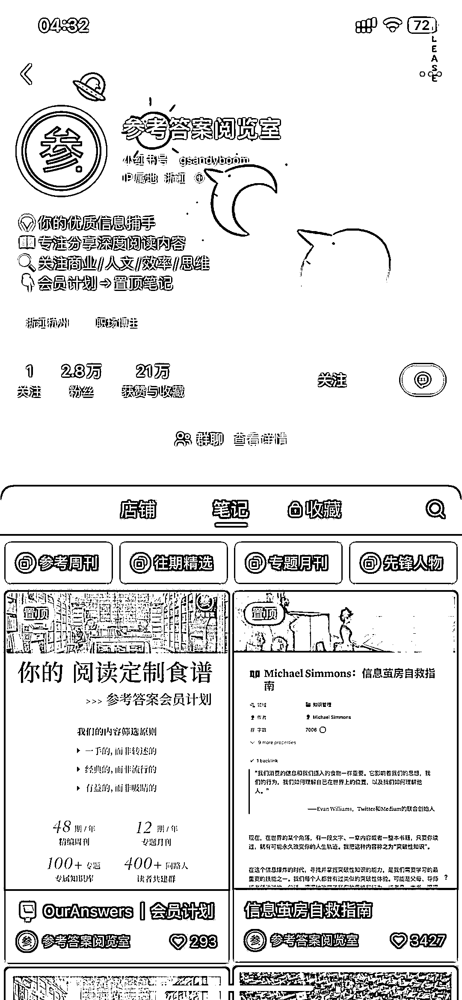
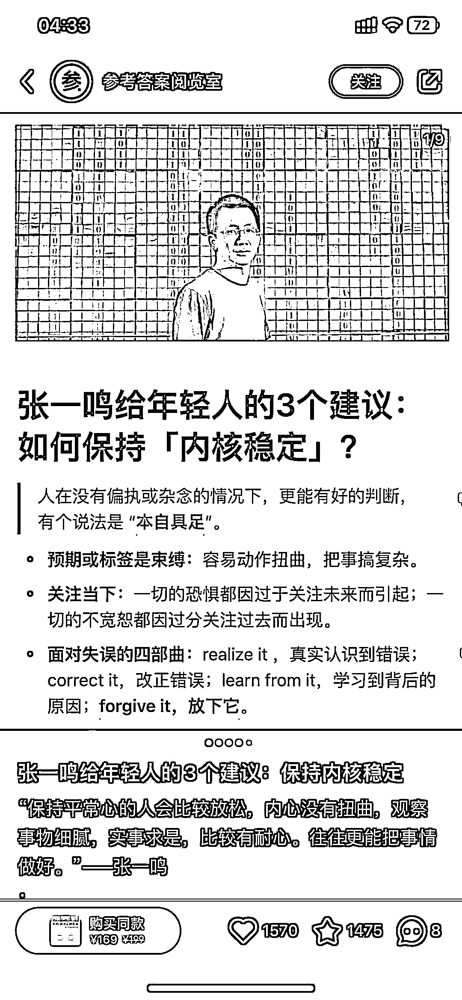

# 小红书商业知识付费模式：直接成交、借势大佬流量，高效带货

> 原文：[`www.yuque.com/for_lazy/xkrm14/oy70s8gv2o8tmmp4`](https://www.yuque.com/for_lazy/xkrm14/oy70s8gv2o8tmmp4)

作者： 亚瑟王

日期：2023-11-21

点赞数：**64**

* * *

正文：

小红书做商业知识付费销量 3000+，这个模式很值得各种知识付费产品借鉴 1.平台内直接成交，不用引流，安全稳定
2.笔记内容借势商业大佬自带流量，条条数据不错 3.笔记带货，成交路径非常短，高效 4.已购用户会获取联系方式，添加进私域
5.小红书上只卖这一个单品，平台爆款策略，私域二开多开

* * *

评论区：

能量菌 : 这卖的啥

* * *

公众号懒人找资源，懒人专属群分享