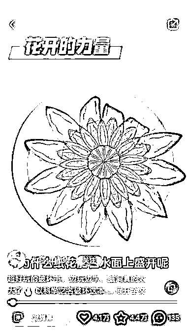

# 小红书上分享绘本的博主，销售火爆，已售出 1.3W 件，销售额 110W+

> 原文：[`www.yuque.com/for_lazy/xkrm14/hq8hlksdsasi9b8n`](https://www.yuque.com/for_lazy/xkrm14/hq8hlksdsasi9b8n)

作者： 老金

日期：2023-11-21

点赞数：**53**

* * *

正文：

小红书上刷到分享绘本的博主。 有意思的是绘本是类似 DIY 手工（博主起名“破坏之书”），并且可以根据不同物品变形（图 1，图 2）
客单价 89 元，已销售 1.3W 件，销售额 110W+（图 3）

* * *

评论区：

速影 : 单品利润有 40 万[色]

老金 : 感谢亦仁老师[玫瑰]

* * *

