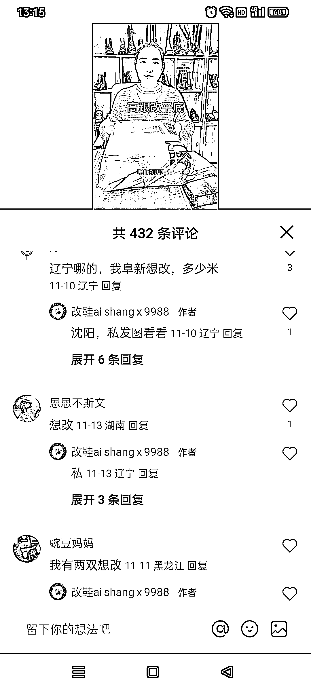
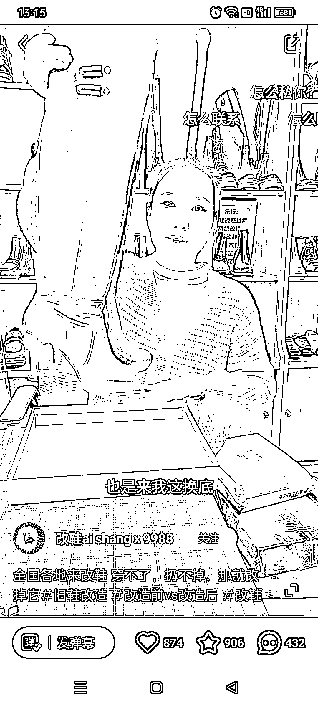
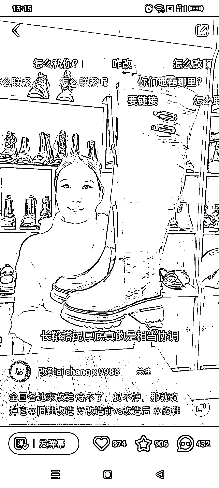

# 小红书上的改造类目，引流微信的好机会

> 原文：[`www.yuque.com/for_lazy/xkrm14/wn5615xqghzia5u9`](https://www.yuque.com/for_lazy/xkrm14/wn5615xqghzia5u9)

作者： 陶美丽

日期：2023-11-22

点赞数：**42**

* * *

正文：

在小红书上看到一个很不错的类目，修改旧鞋、旧衣服、旧包包，版型不喜欢可以改，每家都会有那么几件贵且不实用的皮制品，评论区全是有需求的粉丝，可以引流到微信

* * *

评论区：

* * *

公众号懒人找资源，懒人专属群分享