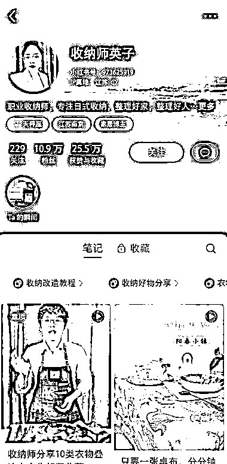

# 小红书收纳师咨询服务和带货家居用品

> 原文：[`www.yuque.com/for_lazy/xkrm14/ggu3psxwfeugzu5m`](https://www.yuque.com/for_lazy/xkrm14/ggu3psxwfeugzu5m)

作者： 流年

日期：2023-11-21

点赞数：**38**

* * *

正文：

小红书做收纳师咨询服务和带货家居用品 很多人普遍工作忙，没有时间整理屋子和网购时没拆封的快递盒堆得到处都是，
到了换季、搬家时，就有了需要收纳的需求，进而诞生了收纳师这个新兴职业。 由于国家经济的发展，会逐渐向服务业转型，
而服务业有人工成本高和含有技术壁垒这两个特点，收纳师不太可能被机器人替代。 目前收纳师的收费方式是每小时计算，新手时薪是 40-60 元，
有经验的收纳师每小时为 100-200 元，对于收纳师可以重点关注有请保姆的家庭。 小红书有些收纳师的变现方式是以咨询服务和分享时顺便带货家居用品，如图一、二。

* * *

评论区：

能量菌 : 能否衍生出来收纳师培训业务

Lion : 三年前抖音就有人卖培训了

流年 : 有经验的可以

流年 : 有合适的对标账号可以参考

钰然 : 最近刷到很多直播收纳技巧的，顺带直播卖收纳盒

* * *

公众号懒人找资源，懒人专属群分享