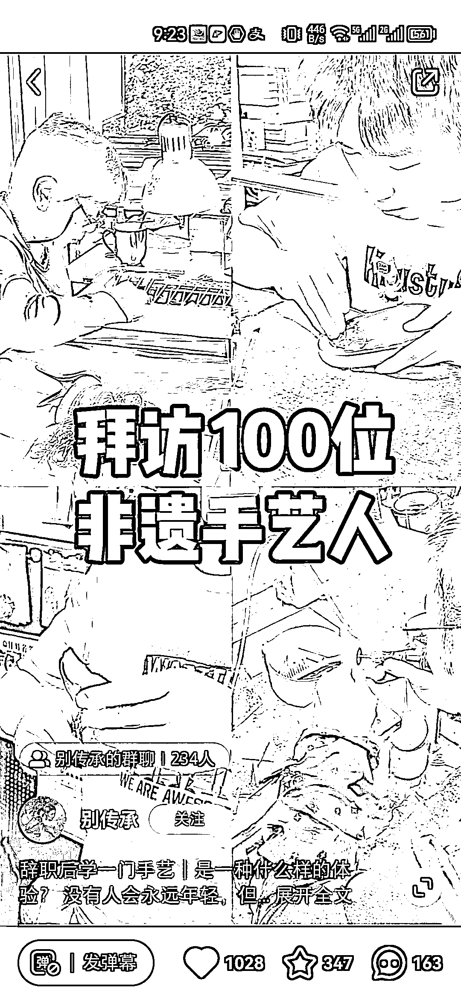

# 小红书粉丝热切学习非遗手艺，开设课程培训赚取高利润

> 原文：[`www.yuque.com/for_lazy/xkrm14/pu6dl8p32dmzg4x8`](https://www.yuque.com/for_lazy/xkrm14/pu6dl8p32dmzg4x8)

作者： 文俊✪

日期：2023-11-21

点赞数：**75**

* * *

正文：

小红书【拜访 100 位非遗手艺人】这个脚本下的粉丝，有 3000 多条问怎么学，这部分可以圈起来做课程培训，让视频比较爆的手艺老师来出课程。另外非遗的产品的溢价能力也很高，文化属性加分许多，可以售卖小众高毛利的产品。

* * *

评论区：

每天晒白牙 : 挑战类账号

冬瓜馄饨 : 这类账号是怎么变现的？

文俊✪ : 谢谢！

刘土豆 : 哇，我家做藤编家具，都是一二十年老师傅纯手工编织，现在天猫生意不好，是不是也能搞起手工藤编培训。。。。[发呆]

菲菲 : 一直想学这种，但真正的非遗会不会有一定的学习门槛啊，不是谁想学就学

* * *

