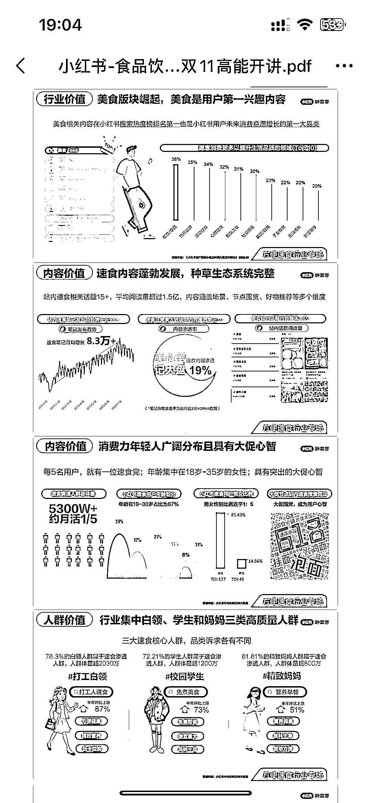

# 小红书美食内容，速食类阅读量超过 1.5 亿

> 原文：[`www.yuque.com/for_lazy/xkrm14/xigavfnhltage8e5`](https://www.yuque.com/for_lazy/xkrm14/xigavfnhltage8e5)

作者： 虾小米

日期：2023-11-22

点赞数：**33**

* * *

正文：

小红书上美食占比排第一 其中站内速食 15➕，但平均阅读量超过 1.5 亿 用户群年龄集中在 18-35 岁 高质量人群覆盖白领，学生和妈妈类 具体信息详见附图

* * *

评论区：

小刀 : 美食是刚需啊！

老彭 : 求分享文档

虾小米 : 谢谢亦仁大佬～

虾小米 : 嗯哼

虾小米 : 需要的话加我 nizuizhuanye，然后我发你

* * *

