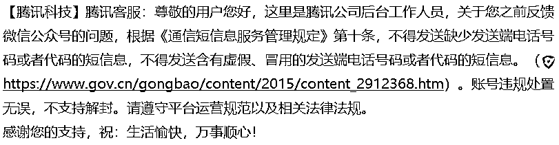

# 公众号“匿名信”遭大规模封禁，项目运营思考后续措施

> 原文：[`www.yuque.com/for_lazy/xkrm14/zhzwbv7zud56zhaa`](https://www.yuque.com/for_lazy/xkrm14/zhzwbv7zud56zhaa)

作者： 十一

日期：2023-11-21

点赞数：**45**

* * *

正文：

近日公众号有关“匿名信”的账号疑似因政策影响，遭到大规模永久封禁，即使清空菜单栏以及群发的文章，也可能被封禁账号，封禁原因多为“该账号涉嫌违反相关法律法规和政策，已被停止使用”。
后续该项目运营的思考： 1.使用新公众号承接流量，新公众号名称以及公众号介绍，文章，都不建议和“匿名信”相关
2.新公众号菜单栏，布置企业微信客服链接，用企业微信客服功能自动回复写信的网页链接 3.企业微信成本，认证成本每年 300+外部联系人 0.1 个人
4.用个 V 接流量，可能会因视频爆流，会接不住

* * *

评论区：

丑八怪 : 匿名信是啥意思 没听过

肖深刻 : 搜了一下，应该是情感领域电台的那种，帮陌生人通过短信电话邮件形式传达给另外一个人。如果是被暴力催债，或者那种有仇呼死你利用起来，就涉及法律层面了

* * *

公众号懒人找资源，懒人专属群分享