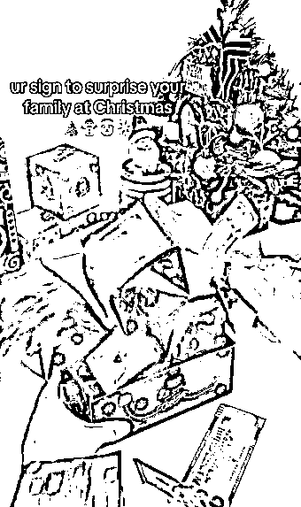
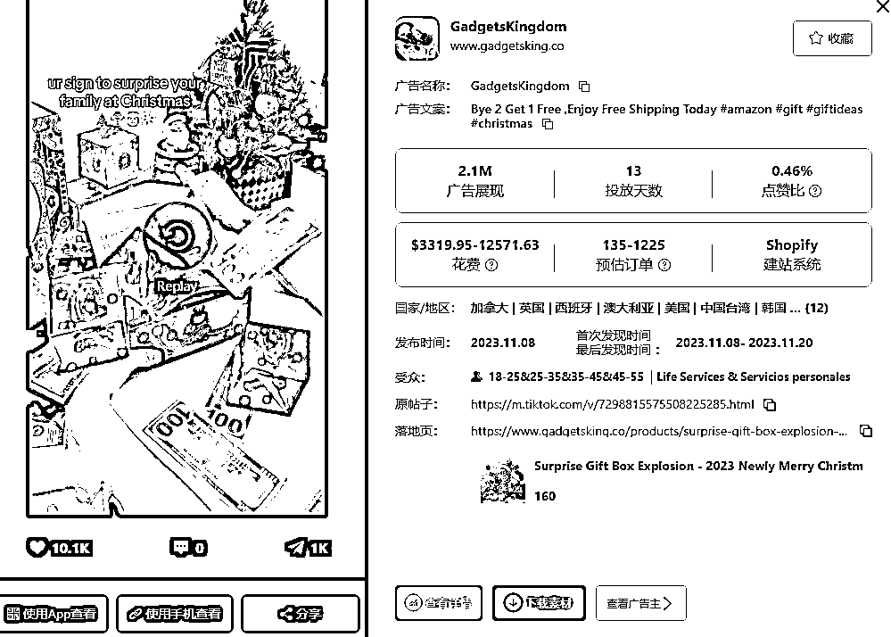

# Tiktok 上热门的圣诞惊喜盒子，适合搭配礼品产品组成套装

> 原文：[`www.yuque.com/for_lazy/xkrm14/hektyq8pu994to0t`](https://www.yuque.com/for_lazy/xkrm14/hektyq8pu994to0t)

作者： Max

日期：2023-11-21

点赞数：**43**

* * *

正文：

这个圣诞主题的惊喜盒子最近在 Tiktok 上很火。
根据数据平台 pipiads 抓取到的数据，该品从 11.08 号开始投放，十多天时间 230 万的广告展现，单素材最高播放量 210 万。
独立站售价 24.99 美刀，阿里巴巴类似款式在 20 人民币左右。
很适合搭配圣诞礼品类产品组成套装。惊喜盒子+送礼产品，融合有趣+情感属性是不错的选择。有做礼品类的跨境卖家可以参考一下

* * *

评论区：

能量菌 : 搬到小红书上应该也不错

* * *

公众号懒人找资源，懒人专属群分享