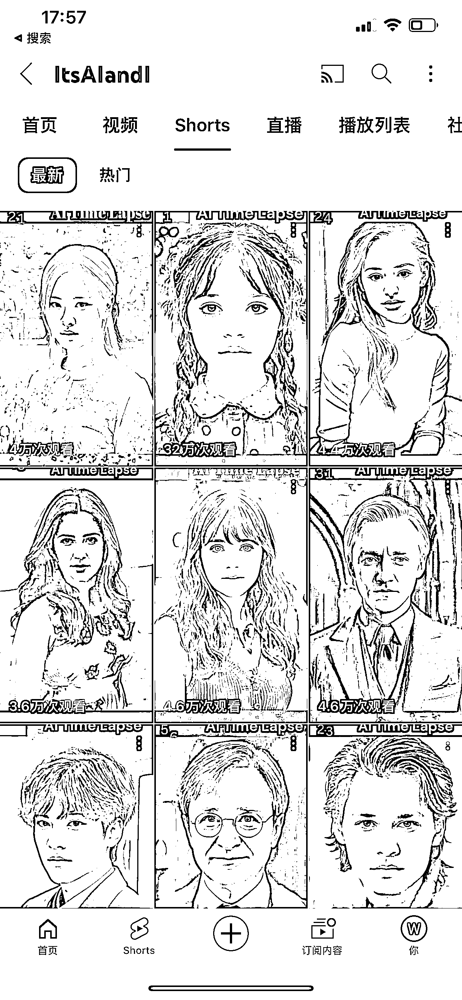
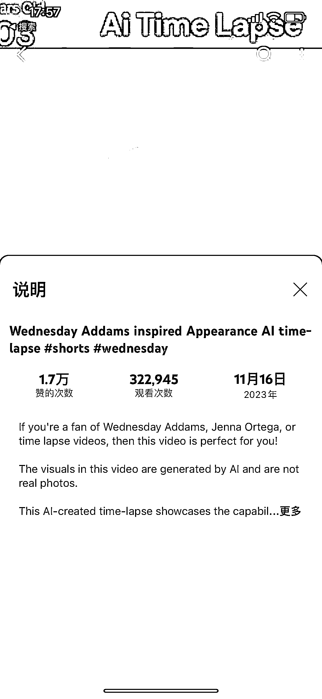
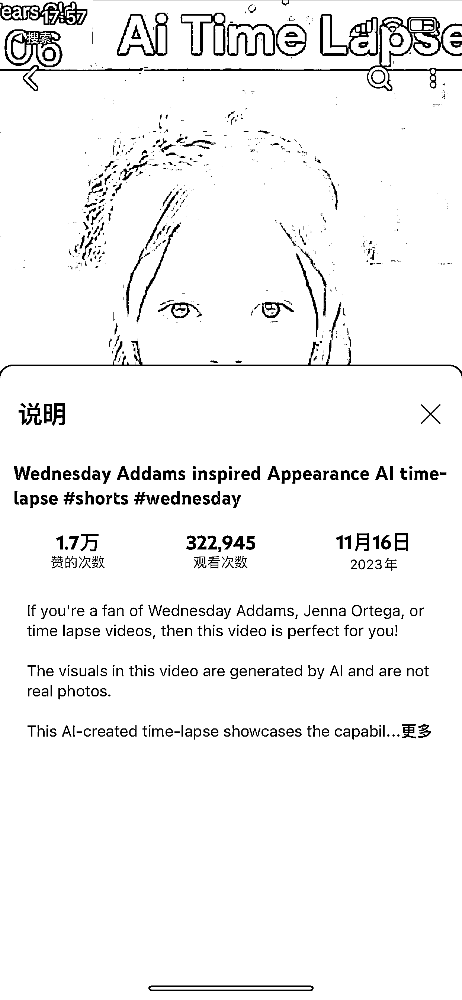
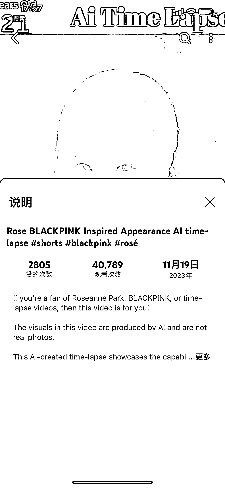
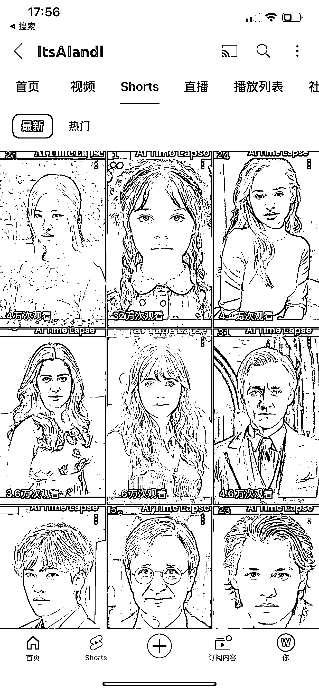

# YouTube AI 动画作品：7 个多月 250 个视频总播放量近 5900 万

> 原文：[`www.yuque.com/for_lazy/xkrm14/yrbydqgy500i2xbs`](https://www.yuque.com/for_lazy/xkrm14/yrbydqgy500i2xbs)

作者： 林林 AIGC 写作

日期：2023-11-21

点赞数：**71**

* * *

正文：

YouTube shorts 分享 AI 动画作品，7 个多月 250 个视频总播放量将近 5900 万。
这些视频的内容很简单，就是用 AI 模拟很多明星从童年到老年样貌变化的过程，非常的杀时间，很容易给用户沉浸式的观感。
即使是最近几期短视频，播放量也是相当可观，播放量突破 30 万也不是什么难事。 总之，只要是掌握 AI 绘画相关技能的圈友，千万不要放弃 YouTube 这块沃土！

* * *

评论区：

🚁 柯伊伯🚁 : 这种怎么赚钱？

林林 AIGC 写作 : 平台补贴的创作者收益或是转化到私域

🚁 柯伊伯🚁 : 感谢解答，再请问一下私域变现：针对个人提供服务，卖课，收徒吗？除了这些还有什么变现方式

林林 AIGC 写作 : 你说的这些了 剩下的你问 GPT 吧😂

🚁 柯伊伯🚁 : 谢谢😜

* * *

