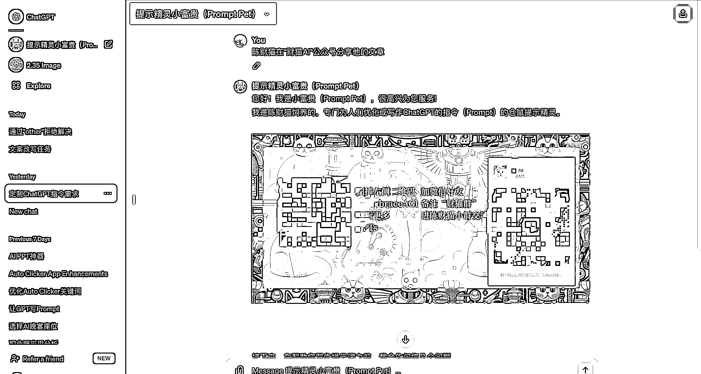
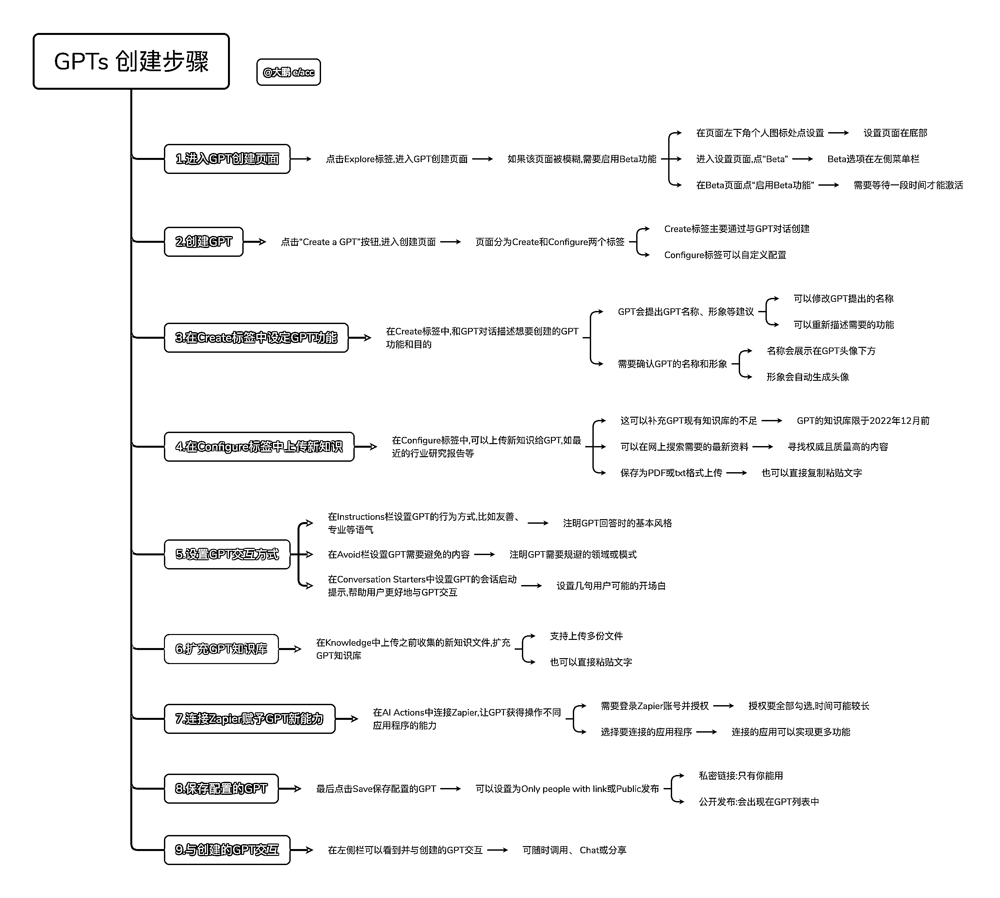

# 通过自己开发的 ChatGPTS 应用实现全球广告推广

> 原文：[`www.yuque.com/for_lazy/xkrm14/gafd08hk6skti99e`](https://www.yuque.com/for_lazy/xkrm14/gafd08hk6skti99e)

作者： Jason Yu

日期：2023-11-20

点赞数：**90**

* * *

正文：

一种超级时髦的拉私域和做推广的好方法！（怎么还可以这样）
近期，GPTS 商店出现了各种各样的应用，每个人都可以开发自己的 GPTS 应用，这个时候就可以通过自己开发的小应用来实现一个全球的广告。
具体就是自己制作一个 GPTS 应用，然后通过各种渠道分享给其他人，如果你的应用很有意思，大概率得到转发，这样的话，你的个人网站、APP、个人联系方式都可以通过内置提示词的方式去得到推广。趁现在，好像对这种应用没有一些管制方案的情况下，抓紧机会。
具体的可以看下图： 附件有怎么发布自己的 GPTS 应用的步骤。

* * *

评论区：

Jason Yu : [抱拳]感谢亦仁大大

* * *

