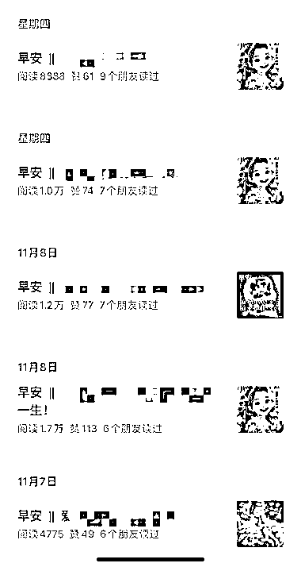
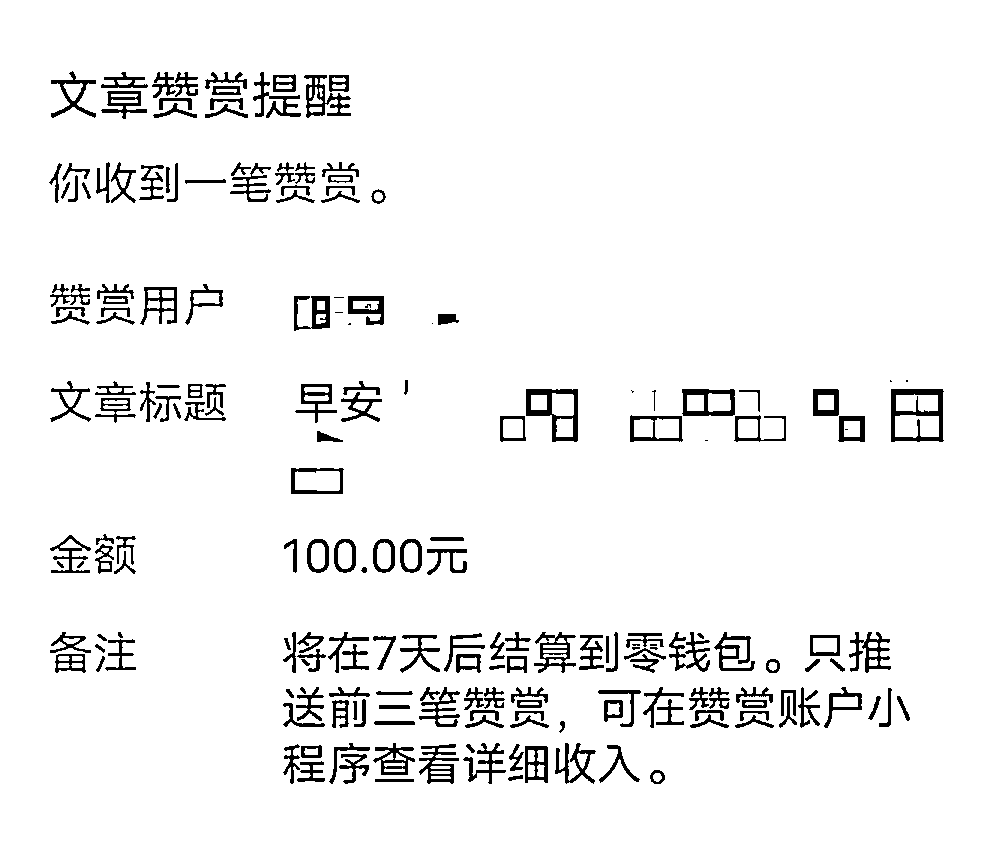

# 早安鸡汤文配 AI 图，轻松获取高流量

> 原文：[`www.yuque.com/for_lazy/xkrm14/onux4nbg5iwcmi3c`](https://www.yuque.com/for_lazy/xkrm14/onux4nbg5iwcmi3c)

作者： 月见草

日期：2023-11-22

点赞数：**54**

* * *

正文：

发发早安，配合鸡汤文和 AI 图，就可以获取不错的流量，需要注意标题一定要有早安这个关键词。

* * *

评论区：

贤雅 : 字数限制有吗？

兰心 : 这个厉害了

Sunshine😊💝 : 厉害！

月见草 : 感谢亦仁大佬

月见草 : 尽量超过 1200 字，可以开通流量主放 2 篇广告

贤雅 : 🆗

行走的大头 : 这种属于什么类别，情感？还是鸡汤？

* * *

