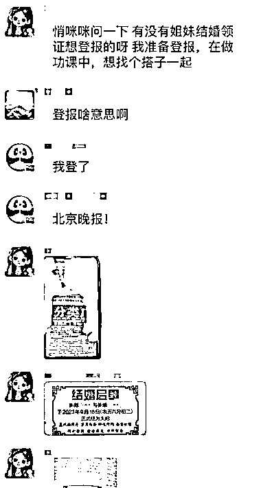
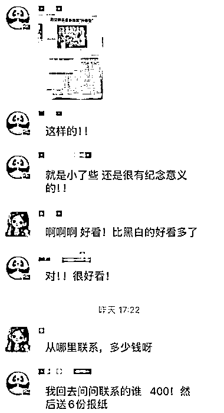
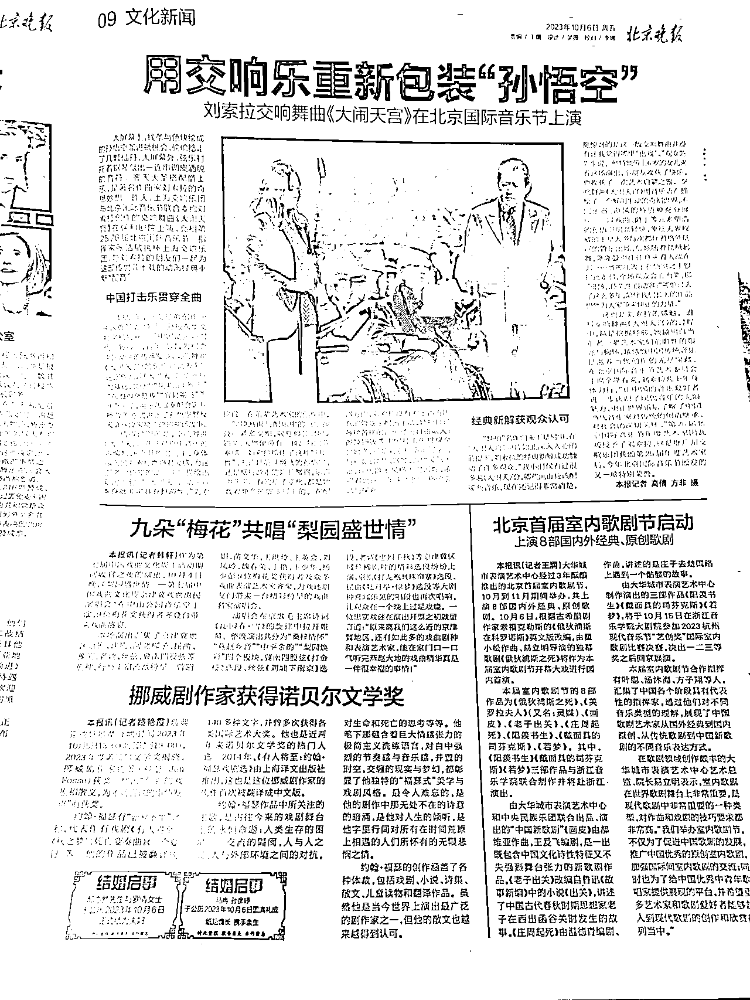

# 传统浪漫再现，结婚启示登报成新潮流

> 原文：[`www.yuque.com/for_lazy/xkrm14/ty6g3whegmo17hhi`](https://www.yuque.com/for_lazy/xkrm14/ty6g3whegmo17hhi)

作者： Ajin 锦儿🍑

日期：2023-11-23

点赞数：**95**

* * *

正文：

报纸登【结婚启示】 这种在民国时期就有的形式，现在也可以登报，传统的浪漫。 在备婚群看到的，小红书上也有很多
掌握途径，帮联系不同地区和报社，做为中间人也是一种思路！

* * *

评论区：

恒一 : 有意思

小刀 : 这个不错，把这个玩法搬到线上，应该很多女生会喜欢能循环起来。

Ajin 锦儿🍑 : 哇哇哇，激动，第一次中标ε=ε=(ﾉ≧∇≦)ﾉ

应豪 : 之前在抖音刷到过一个博主结婚登报的视频，没想到这也有需求

万航宇 : 搜了一下，有公司再做..还有小程序..😂不过最近正好结婚了，我看看价格合适的话，我也搞一个，还挺有意思的感觉。

时新 : 你搜了嘛？你们那边多少钱呀？我看了一下山西这边最低 520[天啊]

万航宇 : 300-600 这样[捂脸]

* * *

公众号懒人找资源，懒人专属群分享