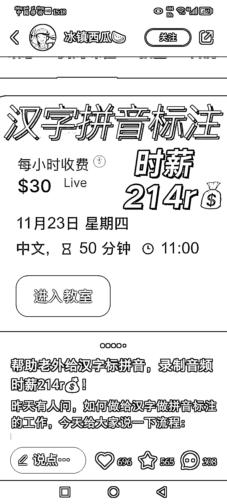
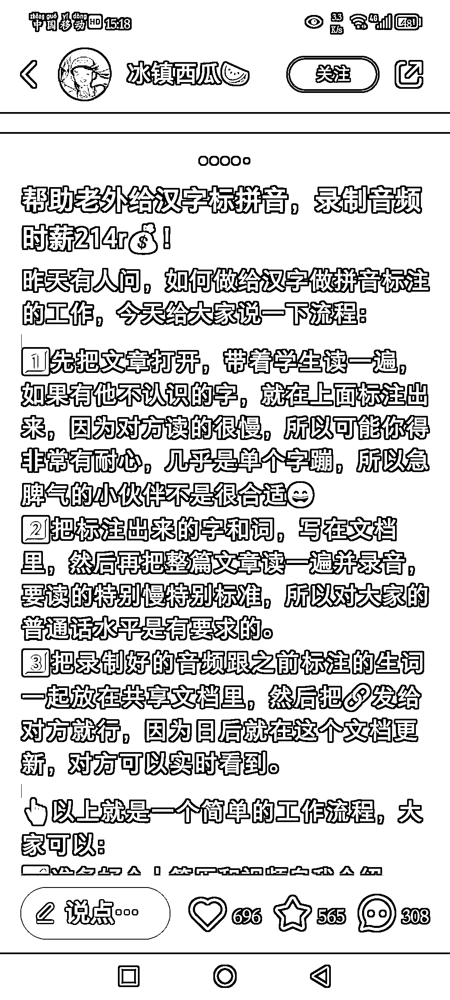
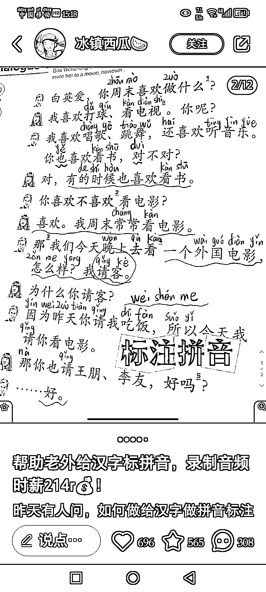

# 外国人学汉语现在也是比较火的，给老外进行汉语拼音标注

> 原文：[`www.yuque.com/for_lazy/xkrm14/ica8mf1fitxpa60v`](https://www.yuque.com/for_lazy/xkrm14/ica8mf1fitxpa60v)

作者： 贤雅

日期：2023-11-23

点赞数：**77**

* * *

正文：

给老外进行汉语拼音标注。外国人学汉语现在也是比较火的。

* * *

评论区：

Angie•三三 : 这个好，感觉可以让家里读小学的娃先标一遍，自己检查下顺便提升娃拼音成绩😂

白猫｜今天是虎斑猫 : 这男的想跟女的约会，女的还让他请别人一起[憨笑][憨笑]价值观笑死我😂😂😂

贤雅 : 感谢亦仁，我终于中标了

 杰克船长 🍼 : 这是哪个平台呢？

文少 : 好奇那个进入教室是啥平台

贤雅 : 小红书，搜博主名，这个需要证

贤雅 : 小红书搜博主名

* * *

