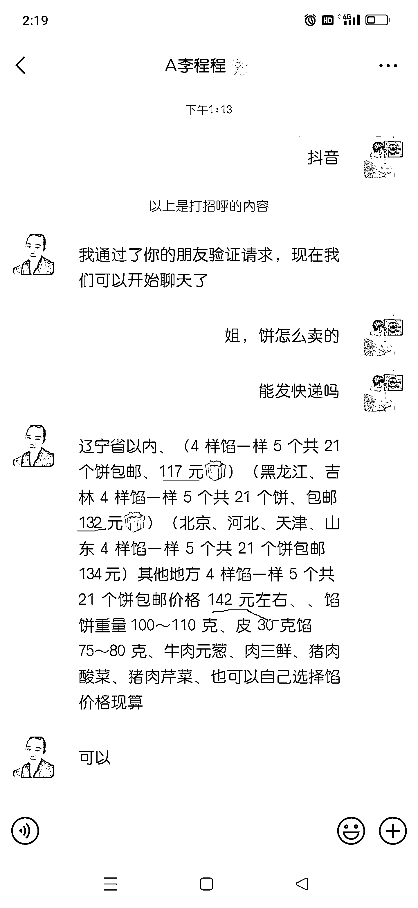
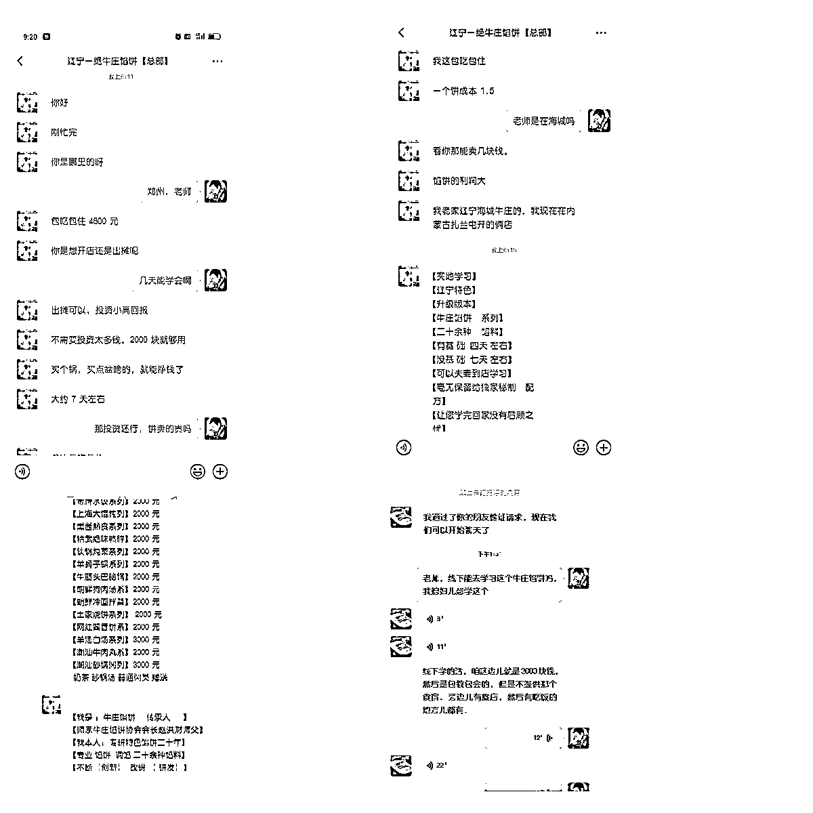

# 下沉市场赚钱模型，复制成功的蓝海赛道

> 原文：[`www.yuque.com/for_lazy/xkrm14/xygxw9f2zeybpoif`](https://www.yuque.com/for_lazy/xkrm14/xygxw9f2zeybpoif)

作者： 高远

日期：2023-11-23

点赞数：**56**

* * *

正文：

这是一个论证赚钱就是复制的典型账号，主打下沉市场，从早卖到晚的高频轻刚需，可放大到月入 3 万到 10 万的生意模型。给我一分钟，我来讲给您听，还请各位餐饮老炮帮我看看，这是不是一个资本还没有介入的蓝海赛道。
账号：A 李程程，产品：辽宁海城的牛庄馅饼，与北京的香河肉饼都属于非遗，产品在北方小吃有一定的口碑，上广深线上任何外卖，团购实体店铺，北京有两家丑团店，遗憾的是下架了商品。（信息来源于美团）
通过简介电话，顺势加上微信，客单价，在 117-142。下单之前，我先去翻了一下朋友圈，通过朋友圈一个月可见再加上朋友圈的文案，我感觉这应该是一个中介号，然后顺着抖音搜索，找到该赛道头部达人牛庄馅饼浩哥，抖音 10 万粉丝。
通过简介很难第一时间找到其微信，我又去快手同名搜索，发现其快手竟然有 33 万粉丝，看样子深耕主流平台在快手，因此也可判断其粉丝画像，主要集中 30-50 岁。拿考古加去验证，大差不差。
我又翻看牛庄馅饼浩哥的朋友圈，从 2023 浏览到 2019 年，一直深耕这个单品。学员培训费也从 500 涨到了 3000（不包吃住），中间还经过一次维权官司，原因是别人盗他视频，那时候利润是几万一个月，那年 2021 年。（下图有截他朋友圈图）。
回看前面 A 李程程的账号，基本从短视频到朋友圈，都是复制牛庄馅饼浩哥这个账号的前后端。那这到底是不是一个好生意，还需要从算账，成本等一系列角度来分析，然后我又去扒同行他们，看看他们的变现与收费形式。
从一个老大哥那边了解到一个馅饼的成本是 1.5，基本客单价在 5 到 8 快一个饼，给当地具体消费水平，还有馅饼的馅与量不一样，自己定价。
后端变现主要有两部分，一个线上引流来的零售客户，第二部分就是小吃创业培训，线上视频教学，588 左右，线下都是包教包会，包回头客，收费在 3000 到 4800，转化成学员的数量，给他们聊得案例，有 500 多，有千把的。关键就是加上之后你不理他，他也不搭理我，纯靠朋友圈，短视频自然转化。
回过头来，在看这个产品的流量获取，在于馅饼视频的设计巧妙，大家可以搜索账号看一遍就明白了，非常好拿同城流量，观察的这个产品同行，基本都是一天一条视频，也都还没投流。
不知道是不是有圈友在做或者观察到这个生意。

* * *

评论区：

* * *

