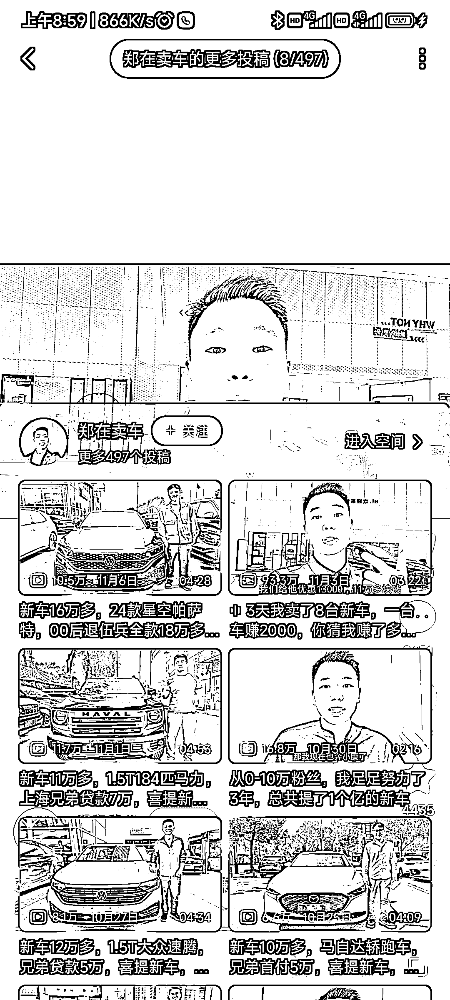

# 通过 B 站和 4S 店合作，特价卖新车，省钱又省心

> 原文：[`www.yuque.com/for_lazy/xkrm14/oqqna8okwn7kuli2`](https://www.yuque.com/for_lazy/xkrm14/oqqna8okwn7kuli2)

作者： 张老师

日期：2023-11-24

点赞数：**53**

* * *

正文：

帮买新车的宣传销售方式，
通过 B 站来宣传，通过和 4S 店来沟通，构成特价卖新车的方式，而且客户真实省钱而且不用管砍价问题，只要对接好当地大的 4S 店就可以了，然后通过网络宣传来达到特价售卖的形式，
一方面方便了客户（特价买新车） 一方面 4S 店获利（免费的卖车人） 一方面通过 B 站等视频平台去宣传
而且这个行业普通人只要是和 4S 店打通，就可以操作，先在当地来宣传，再通过网络销售全国市场，
博主自曝是每台 2k 的毛利润，上个视频是 3 天做了 8 台，就是 16k 的毛利润，而且这个成本较低，最大的成本就是宣传，圈友，尤其是卖车的圈友可以参考弄一下

* * *

评论区：

胖大魔 : 这应该走其他渠道吧

尚阳学长 : 可能走的是资源车，现在油车每台两千的佣金可以说几乎不可能，门店给到销售的提成也就三四百，博主不用基本工资，均摊下来再给加个几百，一千最多了。现在车的利润薄到无法想象，还有些小的新能源车，每卖一辆厂商就要赔几百

* * *

