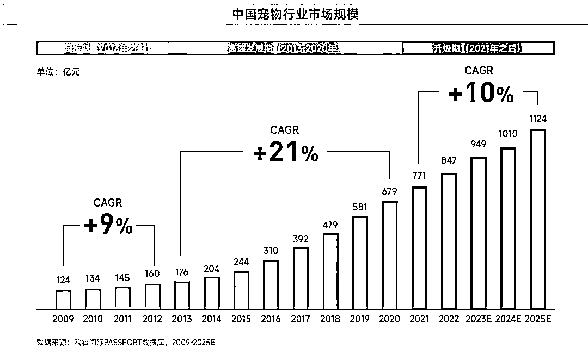
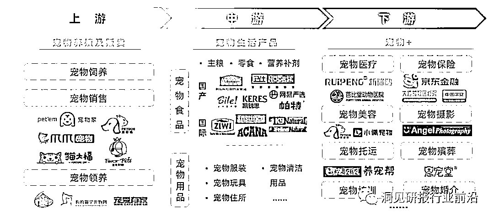

# 中老年人成为养宠主流，宠物赛道迎来商机

> 原文：[`www.yuque.com/for_lazy/xkrm14/pm4rwx2gxlutqc4x`](https://www.yuque.com/for_lazy/xkrm14/pm4rwx2gxlutqc4x)

作者： 李瑞腾

日期：2023-11-23

点赞数：**52**

* * *

正文：

中老年人，正在成为养宠主流人群 老龄化程度加深，老年人口增多是宠物赛道发展的核心驱动力之一已经成为市场共识。探索宠物消费赛道中的银发商业机会
欧瑞国际数据显示，2022 年，中国宠物行业市场规模达到 847 亿元，在过去 18-22 年复合增长率高达 15%，且预计未来 23-27 年依旧会保持双位数的增长。
银发族养宠，被视为宠物经济持续增长的重要动力。
对于退休老人尤其是独居老人而言，养宠物不仅可以获得陪伴，缓解孤独，还可以在与同龄“猫友”、“狗友”的交流，认识新朋友，增加社交互动
把宠物视为家庭成员，由此衍生出的宠物消费以情感消费为核心，更具有持续性。在为宠物消费方面，“有钱有闲”的银发族展现了较强的消费意愿与消费能力。
京东数字研究院发布的《代际消费洞察报告》显示，60 后用户在宠物消费上有着巨大的动力，其宠物消费偏好是 80 后的 1.7 倍。
历届双 11 电商平台公布的购物趋势中，宠物相关用品常常位列银发族最爱买物品清单。 银发宠物消费六大特征 1\. 消费能力强，付费意愿高
养宠物的老人以 55-70 岁的活力老年人为主，他们有一定的财务积累，经济自由，同时愿意拥抱变化，消费理念开放。 2\. 稳定回购，信任消费
与为自己购买商品的信任消费习惯一致，老年人在选择宠物店、选定宠粮品牌等方面，忠诚度高，会持续复购。 3\. 重视宠物健康消费
老人们普遍反馈宠物看病花销大，但他们表示医疗消费十分必要。 《2021 精致宠物消费白皮书》显示，70 后养宠人群重视宠物健康，更爱在直播间购买诊疗、保健用品。
4\. 好学、听劝：科学养宠意识提升 一直以来，老人“不听劝”常常成为讨论的焦点。然而，老人对于科学养宠的知识的需求十分强烈，学习热情高涨，愿意“听劝”。
5\. 消费决策受子女、同龄人影响大 中老年人养宠，全家参与消费的现象很普遍。 以选择宠物食品品牌为例，老人们购买狗粮主要有两种情况：
一种是由子女选定具体产品，直接网购邮寄到家，熟悉网购的老人会在子女的推荐下自行网购；另一种是，老人受到一起遛狗的同龄朋友推荐，到宠物店、超市等线下场所挑选购买。
6\. 在类别上，宠物用品、服务消费大于宠物食品消费
综合宠物店主、老人自述，现在，老人已经普遍会定期、规律性进行宠物基础服务消费，即宠物洗浴、宠物剃毛等。少部分养猫与小型犬的老人会购买宠物专用洗浴用品，自己在家中给宠物洗浴。
QuestMobile 数据显示，截止到 2023 年 8 月，全网宠物兴趣人群达到 3.23 亿，其中 46-50 岁占比 10.6%，51 岁以上占比 19.5%。

* * *

评论区：

* * *

