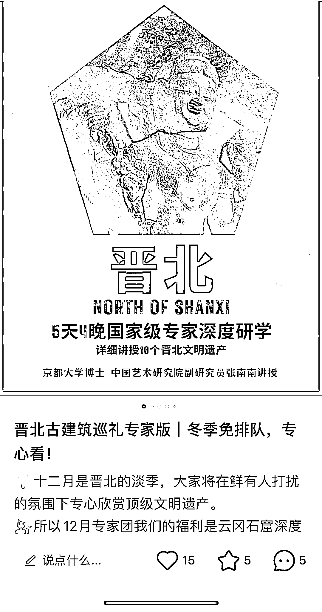
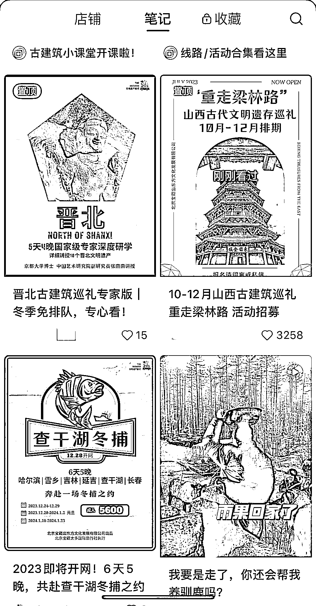

# 定制旅游线路：不仅仅是奢侈享受，还有高客单的机会

> 原文：[`www.yuque.com/for_lazy/xkrm14/absc8v1voe9bat8p`](https://www.yuque.com/for_lazy/xkrm14/absc8v1voe9bat8p)

作者： 丁 Ding

日期：2023-11-23

点赞数：**60**

* * *

正文：

大家都知道旅游赛道火，这时候旅游线路的差异化就变得尤为重要。 不只是提供奢侈享受的旅游线路能卖高客单，富有人文底蕴的定制旅游线路在我看来也是能卖高客单的。
比如下图里的这些，比如有高校专家带队讲解，相当于研学的旅游线路等等。

* * *

评论区：

柳柳 : 中国国家地理搞的考察式深度旅游可火了

丁 Ding : 谢谢亦仁老师～

张小悦 : 建筑行业不好，各种建筑周边转型

* * *

