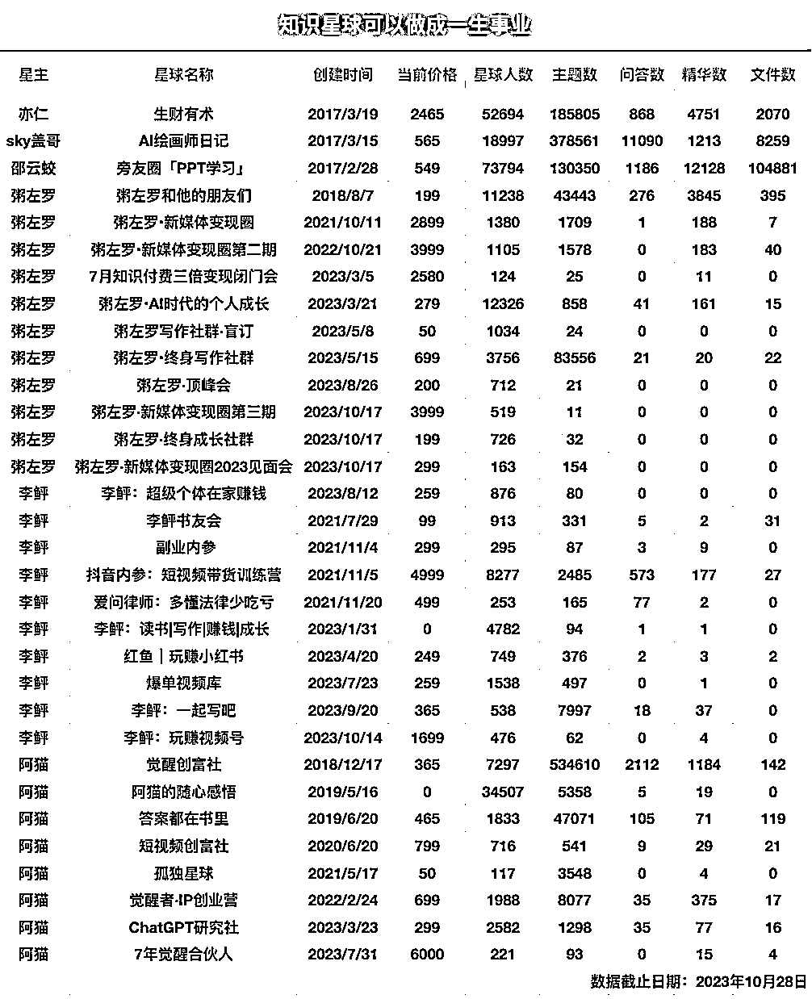

# 了解知识星球矩阵玩法

> 原文：[`www.yuque.com/for_lazy/xkrm14/xph4ff4bbglggafw`](https://www.yuque.com/for_lazy/xkrm14/xph4ff4bbglggafw)

作者： 阿兵哥

日期：2023-11-22

点赞数：**62**

* * *

正文：

知识星球矩阵玩法

* * *

评论区：

波叔 : 这个牛逼

Dude。 : 不太明白 怎么搞的呀

李治国 : 怎么搞呀？

胡洋 : 逻辑了解后，越搞越顺，高手搞模型

银老板 : 每个领域开一个星球，主打垂直细分，比如写作、读书、项目、电商等等，随着自身成长就会 get 到越来越多的技能点，这个是跟随成长轨迹来做的

🌀狗娃(=ﾟωﾟ)ﾉ* : 一个人可以开这么多🌍哇

* * *

