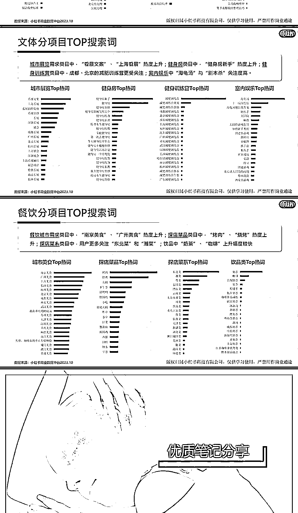
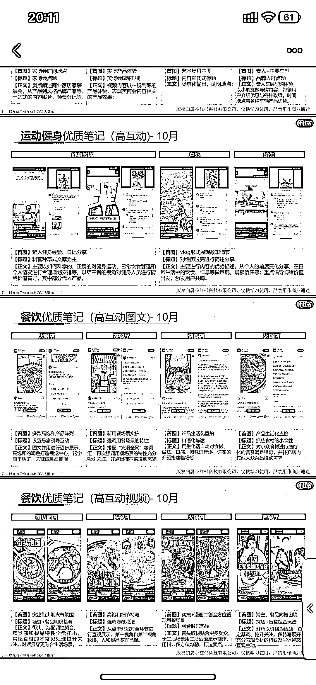

# 利用官方报告寻找商机和流量密码

> 原文：[`www.yuque.com/for_lazy/xkrm14/vnq38090vgtb1p6s`](https://www.yuque.com/for_lazy/xkrm14/vnq38090vgtb1p6s)

作者： 亚瑟王

日期：2023-11-23

点赞数：**45**

* * *

正文：

看官方报告找商机和流量密码 小红书各行业流量热词 在标题正文标签埋这些词 基础流量都不会差 要习惯看数据报告 可以找到很多商机和玩法

* * *

评论区：

鱼兄 : 官方报告去哪里获取呢

舍予 : 这里哦[小红书行业月报 2023 年 10 月](https://xue.xiaohongshu.com/p/t_pc/course_pc_detail/camp_pro/course_2YbaEgUYfVB5cd2TxkR31h2pDCy) 

* * *

