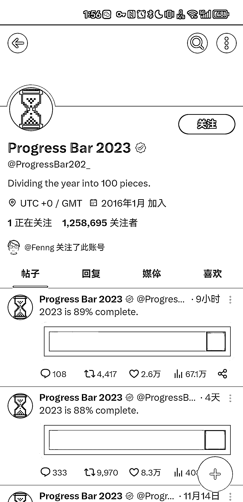
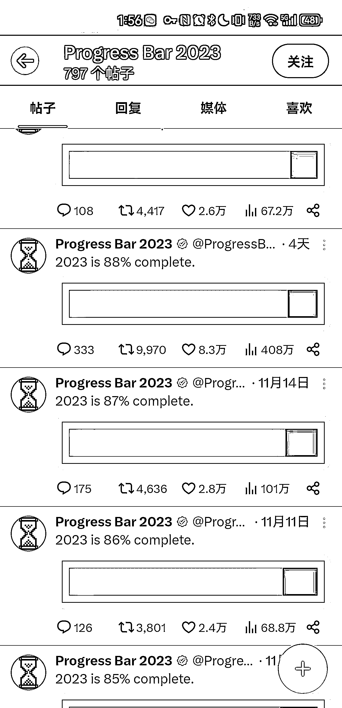

# 创作者在 x 上发布内容获得“创作者激励”，小工具成为关键

> 原文：[`www.yuque.com/for_lazy/xkrm14/zl3upnv7tdcvin35`](https://www.yuque.com/for_lazy/xkrm14/zl3upnv7tdcvin35)

作者： TTTTL

日期：2023-11-23

点赞数：**33**

* * *

正文：

创作者在 x 上发布内容就能获得“创作者激励” （好像现在需要一个额外的条件：蓝标） 因为这个流量激励似乎对于创作者内容的要求并没有做过多的限制
那么其实像下图的一类小工具就能够获得不错的订阅和流量 （图里的帐号是一个将一整年换成一个百分之百的进度条，按百分之一的进度进行推送）

* * *

评论区：

Mars.漆 : 没看懂。。在哪个软件上的

胖大魔 : x 啊

TTTTL : 前身是推特，现在改名 x 了

* * *

