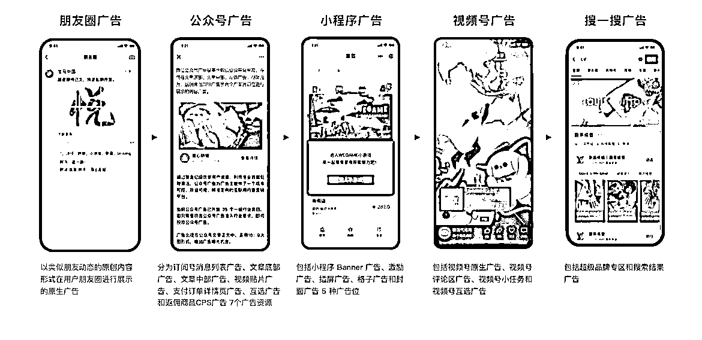
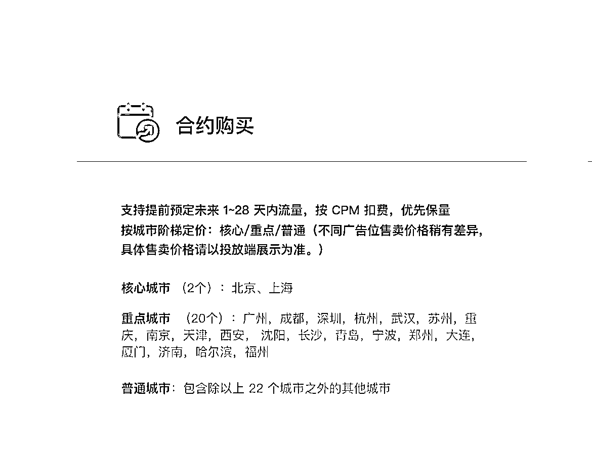

# 微信广告开放服务商：品牌投放多种形式广告，个人可做流量主，价格更美丽

> 原文：[`www.yuque.com/for_lazy/xkrm14/tmk4dlt7wyx0vfzx`](https://www.yuque.com/for_lazy/xkrm14/tmk4dlt7wyx0vfzx)

作者： 十巷

日期：2023-11-22

点赞数：**31**

* * *

正文：

微信广告开放的广告区域服务商，可以帮品牌投放图 1 几种形式的广告，收费参考图 2.3。
所以有产品的可以成为广告主，个人的可以做流量主，这种公众号的互选广告应该比程序化广告价格更美丽
同时，风向标:同类型的公众号可以通过这种互选广告相互导流，相互推荐

* * *

评论区：

* * *

