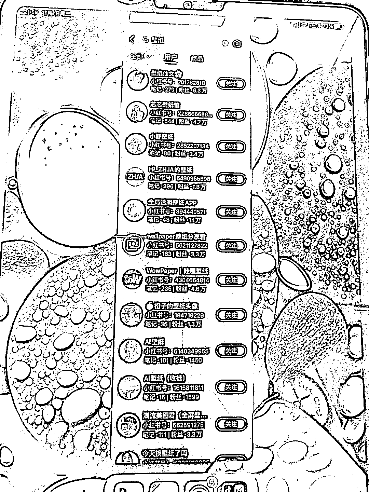

# 小红书壁纸创业，月入 10 万+的赚钱机会

> 原文：[`www.yuque.com/for_lazy/xkrm14/soqvgfi0t80v1m1n`](https://www.yuque.com/for_lazy/xkrm14/soqvgfi0t80v1m1n)

作者： 老薛

日期：2023-11-01

点赞数：**158**

* * *

正文：

小红书生成壁纸月入 10 万+ 和几个 00 后大佬交流，发现换手机后都需要重新买手机壁纸，甚至需要有人给他们做定制服务。
在我的认知范围只要免费下载的东西，不需要多此一举，结果搜索后发现是我的认知局限。 一张壁纸 3.9 元，如果任选 3 张可以 9.9
，如果包年可提前只要 58.包年定制服务 168。
粗略看了一下矩阵，xx 工作室 3 人，6 红薯店，月综合销量 2w+还有包年几千用户，私域大几百人，粗略统计月入 15 万，稳定，虚拟，高复购，高利润，无客诉且具备服务属性。

* * *

评论区：

生姜 : 说实话，不太能理解[惊讶]

老薛 : 搜看看，手机壁纸需求有多大

小刀 : 两三年前在微信小程序中的玩法，现在跑小红书玩来了

红果果 : 真是认知限制了我的想象呀！

黄莉莉 : 可以请问这种壁纸怎么生成吗

晨冬 : midjourney

Zhong 阿钟 : 署店月综销量 2W+，包年用户是一次性基本无复购也没必要复购就算（168*4000=67w，平摊每月 5.6w），私域几百人+小程序取图等能带来每月其余 7w+的收入？望详解

老薛 : 私域 2 万好友/专属定制服务，可以了解一下。

* * *

公众号懒人找资源，懒人专属群分享