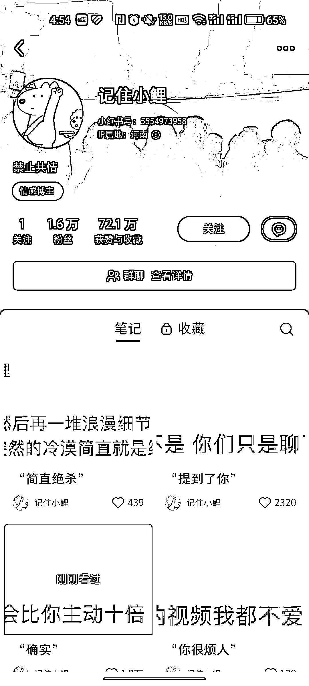

# 小红书文案号，探索情感赛道变现，流量互动大

> 原文：[`www.yuque.com/for_lazy/xkrm14/czrodntrwm897i2p`](https://www.yuque.com/for_lazy/xkrm14/czrodntrwm897i2p)

作者： 子凌

日期：2023-11-01

点赞数：**71**

* * *

正文：

小红书文案号，截图微博文案，流量很好互动很大。但目前的变现方式只看到了接广告且数据不太好。觉得后期可以往情感赛道去变现，文案类型都是情感方面的，先积累一波人群然后做情感，感觉是个不错的选择。

* * *

评论区：

better me : 貌似直接卖号也不错

云端 : 这种硬插的广告单价会不会低？

子凌 : 感谢亦仁大大

子凌 : 对滴

子凌 : 看着是会比同粉丝段低一些，需要借助三方平台看一下他的报价。

熙攘 : 投入产出比来说这广告赚的钱也不低了

* * *

公众号懒人找资源，懒人专属群分享